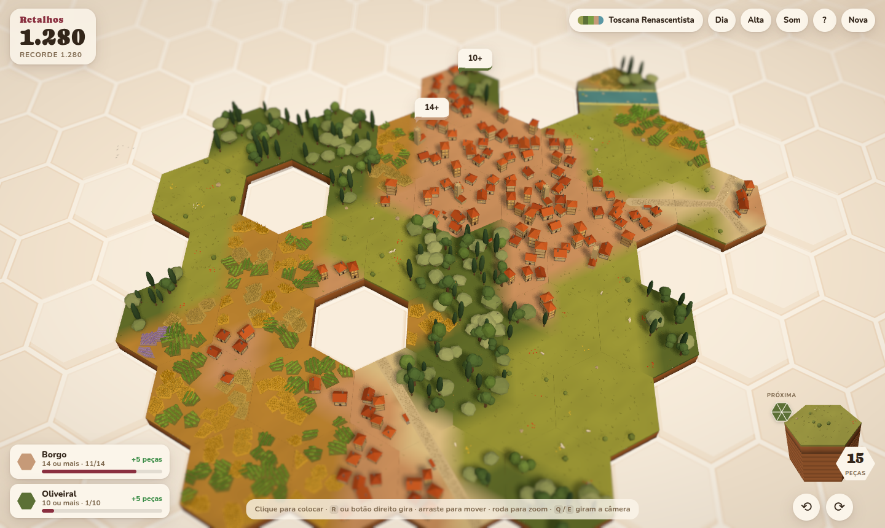

# Retalhos

Puzzle relaxante de peças hexagonais, no gênero de Dorfromantik, com **14 temas de países e épocas**, **interações entre tipos de borda** e um mundo que se mexe: trigo ondulando ao vento, barcos descendo os rios, trens e caravanas nas estradas, moinhos girando, animais pastando e janelas que acendem à noite. Feito com Three.js (WebGPU, com WebGL2 automático onde não houver WebGPU), TypeScript e Vite, sem nenhum arquivo de arte: peças, casas, plantações, animais e sons são gerados em código.



- **Estudo de viabilidade:** [docs/VIABILIDADE.md](docs/VIABILIDADE.md)
- **Pesquisa de mecânicas, stacks, mercado e aspectos legais:** [docs/PESQUISA.md](docs/PESQUISA.md)
- **Pesquisa dos temas históricos:** [docs/TEMAS.md](docs/TEMAS.md)
- **Para agentes de IA e quem vai mexer no código:** [AGENTS.md](AGENTS.md) (arquitetura, invariantes, como estender e verificar)

## Rodar

```bash
npm install        # Node 22.12 ou mais novo
npm run dev        # servidor de desenvolvimento
npm run build      # gera dist/index.html (arquivo único)
npm run typecheck
npm test           # simula 600 partidas e confere regras, interações, missões e replay
npm run check      # typecheck + testes + build (o mesmo que a CI roda em cada pull request)
```

## Como jogar

Coloque peças encostadas no mapa. Cada borda que combina com a vizinha vale 10 pontos. **Rio e estrada** precisam continuar: só encostam neles mesmos. Quando a peça encosta em 2 ou mais vizinhas e todas as bordas combinam, o encaixe é **perfeito**. Cercar uma peça com 6 vizinhas encaixadas devolve uma peça à pilha. **Missões** pedem grupos de certo tamanho ("9 ou mais", "exatamente 8") e dão peças extras. A partida acaba quando a pilha esvazia.

**Eras da vila:** com 500, 1.500 e 3.000 pontos a vila muda de era (os nomes mudam por tema, como Borgo → Comune → Signoria → Rinascimento na Toscana) e ganha +3 peças. A cada era, o Centro da vila (no meio da primeira peça) muda de forma, de fogueira com cabanas a palácio, e uma onda dourada corre pelo mapa. A próxima peça com vila ergue o marco da era, que o fantasma já mostra antes de colocar.

**Sítios escondidos:** carimbos no mapa marcam ruínas (+60 pontos), tesouros (+2 peças), relíquias (+100 pontos e +1 peça) e mirantes (+20 pontos e as próximas 3 peças à vista por 10 jogadas). Coloque uma peça em cima para descobrir. Ficam em anéis cada vez mais longe do centro.

**Bônus de cada tema:** cada época tem uma regra curta, como a Dádiva do Nilo (borda de rio encaixada vale +5) no Egito ou os Moinhos de pôlder (+5 por moinho) na Holanda. Aparece no menu de temas.

**Desfazer:** `U` ou o botão desfaz a última jogada (3 vezes no Clássico).

**Modos:**

| Modo | Como é |
|---|---|
| Clássico | missões, eras e sítios; acaba quando a pilha esvazia |
| Zen | peças sem fim; pontos e eras por gosto |
| Desafio do dia | semente do dia e regras padrão, iguais para todo mundo; sem desfazer |
| Exploradores | 10 sítios e 50 peças; achar o último encerra, e cada peça que sobrou vale 20 pontos |

**Interações:** algumas bordas diferentes também "conversam". Quando se encostam, rendem +5 e erguem uma construção na borda. A prévia acende em dourado antes de você colocar a peça.

| Encontro | Construção (nome muda por tema) |
|---|---|
| vila + floresta | serraria / carpintaria |
| vila + plantação | moinho de vento ou celeiro |
| vila + prado | pasto com animais |
| plantação + prado | colmeias |

Algumas construções aparecem sozinhas dentro das peças, sem pontuar: vila à beira do rio ganha roda d'água, plantação irrigada fica mais verde e alta, vila junto à ferrovia ganha estação e plantação junto dela ganha silo.

| Ação | Mouse / teclado | Toque |
|---|---|---|
| Colocar | clique | toque no espaço, depois toque de novo ou ✓ |
| Girar peça | `R` / botão direito (`Shift+R` ou `T` para o outro lado) | botões ⟲ ⟳ |
| Mover câmera | arrastar, `WASD` ou setas | arrastar |
| Zoom | roda do mouse, `+` / `-` | pinça |
| Girar câmera | `Q` / `E`, ou arrastar com o botão direito | — |
| Dia, entardecer e noite | `L` ou botão ☀ | botão ☀ |
| Som: música e efeitos, só efeitos, mudo | botão Som; `M` liga ou desliga a música | botão ♫ |
| Ajuda, nova partida, estatísticas | `H`, `N`, `F` | botões no topo |

## Temas

| Época | Temas |
|---|---|
| Antiguidade | Egito do Nilo |
| Séculos V a XV | Jade Song (China), Terra dos Vikings, Toscana Renascentista, Andes Incas |
| Séculos XVI a XVIII | Holanda Dourada, Edo Tranquilo (Japão), Minas Colonial |
| Séculos XIX a XXI | Velho Oeste, Cerrado Dourado, Inverno Nórdico, Jardim Sakura |
| Futuro | Colônia Marciana |
| Fantasia | Vale Pastel |

## Parâmetros de URL

| Parâmetro | Efeito |
|---|---|
| `?theme=toscana` | tema inicial (ids em `src/themes/themes.ts` e `eras.ts`) |
| `?seed=123` | partida reproduzível: a mesma semente dá a mesma sequência de peças |
| `?time=night` | `day`, `dusk` ou `night` |
| `?quality=high` | `auto`, `ultra`, `high`, `medium` ou `low` |
| `?webgl` | força o WebGL2 em vez do WebGPU |
| `?mode=zen` | modo inicial: `classico`, `zen`, `diario` ou `exploradores` |
| `?debug` | mostra FPS, draw calls, triângulos e instâncias |
| `?auto=40` | a IA coloca 40 peças de uma vez (tabuleiro de exemplo) |
| `?demo` | a IA joga sozinha, com animação |
| `?stress=1000` | teste de carga com 1.000 peças |
| `?gallery` | mostra todos os kits do tema lado a lado (depuração visual) |

## Estrutura

```
src/core/      regras puras (não importa three.js): hex, peças, tabuleiro, missões, interações, IA
src/themes/    temas como dados: types.ts (esquema), themes.ts (base), eras.ts (históricos)
src/render/    lib.ts (kits e shaders), tileBuilder.ts (peça procedural), world.ts (cena, luz,
               blocos estáticos, fantasma), life.ts (barcos, veículos, animais, moinhos, pássaros)
src/ui/        HUD em HTML/CSS
src/main.ts    entrada, fluxo da partida, salvamento, modos de teste
scripts/       capturas de tela e teste de carga com Playwright
tests/         simulação de partidas com oráculos independentes
```

## Criar um tema

Um tema é um objeto de dados (`Theme`, em `src/themes/types.ts`, com comentários em cada campo). Copie um tema de `eras.ts` e troque:

- **nomes e cores** dos 6 terrenos, do chão, da água, do fundo e da luz;
- **floresta:** formas de árvore (`conifer`, `oak`, `cypress`, `olive`, `palm`, `bamboo`, `araucaria`, `cactus`, `birch`, `blossom`, `round`, `willow`, `umbrella`, `waxpalm`, `crystal`) com peso e cores;
- **vila:** tipos de casa (corpo `cottage`/`long`/`cube`/`tall`/`round` + telhado `gable`/`hip`/`flat`/`dome`/`pagoda`/`thatch`/`turf`/`stepgable`/`cone`, com enxaimel e chaminé opcionais) e um marco (`church`, `baroque`, `tower`, `pagoda`, `pyramid`, `obelisk`, `windmill`, `temple`, `stave`, `hall`, `pylon`, `kancha`, `watertower`, `dome`);
- **construções opcionais:** a da interação vila + plantação (`windmill`, `granary`, `windpump`, `stilt`), um portal sobre a estrada na entrada da vila (`torii`, `paifang`, `inca`) e uma ponte sobre o rio (`stone`, `wood`, `rope`);
- **plantações:** `wheat`, `barley`, `corn`, `rice`, `tulip`, `lavender`, `sunflower`, `vineyard`, `sugarcane`, `papyrus`, `tea`, `coffee`, `cotton`, `quinoa`, `potato`, `flax`, `mulberry`, `hydro`;
- **animais, barco, estilo de estrada e veículo**, nomes das interações e, se quiser, regras próprias (`rules`).

O tema aparece sozinho no menu, agrupado pela época. Para conferir as formas, abra `?gallery&theme=<id>`.

## Medições

```bash
npm run build
(cd dist && python3 -m http.server 4173) &
node scripts/screenshots.mjs   # docs/screens/*.png (SHOTS=egito,noite para escolher)
node scripts/stress.mjs        # tabela de desempenho (RUNS=300:high para um caso)
```

Os scripts usam o Chromium com renderização por software. Para medir FPS de verdade, abra `?stress=1000&debug` num navegador com GPU. Para escolher o navegador, defina `CHROMIUM_PATH`; sem ele, os scripts usam o Chromium do Playwright (`npx playwright-core install chromium`).
