# Retalhos: estudo de viabilidade

**Pergunta:** dá para criar um jogo parecido com Dorfromantik, com tema adaptável, pequenas mudanças de regra e visual próprio, que rode bem, fluido e bonito?

**Resposta curta: sim.** Para não ficar só no papel, construímos um protótipo jogável nesta sessão. Ele tem regras completas, animações, som, suporte a toque e perfis de qualidade automáticos. Na segunda rodada (v3, seção 13) ganhou **14 temas de países e épocas**, construções detalhadas, **interações entre tipos de borda**, trigo que ondula ao vento, barcos, trens, caravanas, animais e ciclo dia/noite. Tudo cabe em um único arquivo HTML de cerca de 700 KB. O risco técnico é baixo. Os riscos reais estão em outro lugar: afinar o "prazer" do loop, dar identidade visual própria (por questões legais e de mercado) e o escopo de arte para vários temas.


Documentos relacionados:
- [PESQUISA.md](PESQUISA.md): pesquisa de apoio com fontes (mecânicas do original, stacks, desempenho, mercado, jurídico, temas, esforço), feita por um agente Sonnet.
- [TEMAS.md](TEMAS.md): pesquisa histórica dos 8 temas de países e épocas (também feita por um agente Sonnet).
- [README.md](../README.md): como rodar, controles e arquitetura do protótipo.

---

## 1. Veredito por dimensão

| Dimensão | Veredito | Evidência |
|---|---|---|
| Regras e loop | ✅ Viável | Implementadas em ~600 linhas de TypeScript puro (`src/core`), sem dependência de renderização, e conferidas em 3.000 partidas simuladas sem falha (Apêndice A). |
| Visual bonito | ✅ Viável | Estilo "diorama" com peças procedurais, sombras suaves, tilt-shift, água animada, vento nas árvores e fumaça. Veja as telas na seção 4. |
| Rodar bem | ✅ Viável, com medição pendente em GPU real | Uma partida típica (300 peças) usa 61 draw calls e 2,7 ms de CPU por quadro, de um orçamento de 16,7 ms. Com 2.500 peças: 102 draw calls e 6 ms. Detalhes na seção 5. |
| Tema adaptável | ✅ Viável e barato | Um tema é um objeto de dados, com cerca de 70 linhas, que escolhe "kits" de forma e cor. Os 14 temas (do Egito Antigo a uma colônia em Marte) usam o mesmo código (seção 13). |
| Pequenas adaptações de regra | ✅ Viável | Todas as constantes estão em `Rules`, e cada tema pode sobrescrevê-las (ex.: Marte começa com 36 peças e recebe mais missões). |
| Jurídico | ⚠️ Cuidado | Regras de jogo não são protegidas, mas nome, arte, UI e "look and feel" podem ser. Seção 8. |
| Mercado | ⚠️ Competitivo | O gênero é provado, mas movido a hits. Seção 9. |

---

## 2. O que o protótipo já faz

**Jogar:** `npm install && npm run dev`, ou abra o `dist/index.html` gerado por `npm run build`. **Testar:** `npm test` simula 600 partidas e confere as regras contra oráculos independentes.

- **Regras completas**: grade hexagonal, 6 tipos de borda, rio e trilho obrigatórios, pontuação por borda, encaixe perfeito, peça "fechada" (6 vizinhos encaixados) que devolve peça à pilha, missões "N ou mais" e "exatamente N" que falham se passarem do alvo, pilha que acaba e fim de jogo. Uma peça que não cabe em lugar nenhum é descartada automaticamente.
- **Visual**: peças geradas proceduralmente a partir das bordas, com rios que fazem curva, lagos, pontes de trilhos com dormentes, retalhos de plantação, bosques, vilas e torres. O vazio tem uma grade hexagonal que desbota, e a névoa acompanha a cor do tema.
- **Sensação ("juice")**: a peça flutua sob o cursor e gira suavemente, as bordas acendem em branco (encaixa) ou vermelho (conflito), a peça assenta com poeira e as árvores balançam ao pousar. Há brilho no encaixe perfeito, pontos flutuantes, contador que rola e sons sintetizados.
- **Temas**: Vale Pastel, Cerrado Dourado, Inverno Nórdico, Jardim Sakura e Colônia Marciana, trocáveis durante a partida.
- **Plataformas**: mouse, teclado e toque (pinça para zoom, toque duplo para colocar). O layout se adapta ao celular.
- **Fluidez**: qualidade Auto/Alta/Média/Baixa. O modo Auto baixa a qualidade sozinho se o quadro passar de ~26 ms.
- **Persistência e desafios**: a partida é salva como semente + lista de jogadas e retomada ao recarregar, com replay determinístico. A mesma semente dá a mesma sequência de peças para qualquer jogador, o que permite desafios por link (`?seed=123`). Também guarda o recorde.
- **Ferramentas de medição**: `?debug` (FPS, draw calls, triângulos), `?stress=2500` (teste de carga), `?auto=40` (tabuleiro pronto), `?demo` (a IA joga sozinha), `?seed=123` (partida reproduzível).

### Arquitetura

```
src/core/     regras puras (hex, peças, tabuleiro, missões, IA gulosa); não importa three.js
src/themes/   temas como dados: paleta, nomes, formas, densidade, regras
src/render/   three.js: gerador procedural de peça, chunks estáticos, instancing, pós-processamento
src/ui/       HUD em HTML/CSS (missões, pilha, avisos, menus)
src/main.ts   entrada, fluxo da partida, salvamento, modos de teste
```

Separar as regras da apresentação é a decisão mais importante: se um dia o jogo migrar para Unity ou Godot, `src/core` vira especificação executável e casos de teste.

---

## 3. Regras: o original e as adaptações

Valores do original segundo guias da comunidade (ver [PESQUISA.md §1](PESQUISA.md)); podem ter mudado em atualizações.

| Regra | Dorfromantik (Classic) | Retalhos (protótipo) |
|---|---|---|
| Pilha inicial | 40 peças | 40 (varia por tema: Inverno 45, Marte 36) |
| Encaixe obrigatório | rio e trilho | rio e trilho (os nomes mudam por tema: canal, ferrovia, maglev) |
| Ponto por borda | +10 | +10 |
| Encaixe perfeito | 6/6 bordas: +60 e +1 peça | todas as bordas **vizinhas** combinam (mínimo 2): +20 (Cerrado: +25) |
| Peça cercada | parte do "perfeito" | peça com 6 vizinhos encaixados: +30 e +1 peça, inclusive peças antigas que você "fecha" |
| Missões | N+ / exatamente N: +100 e +5 peças | N+ / exatamente N: +10×N pontos e +4 a +6 peças |
| Bandeiras, peças especiais, desfazer | sim | ainda não (próximos passos) |

Essas mudanças mostram o que o usuário pediu com "pequenas adaptações": os números são configuração, não código. Ideias de twists por tema estão na seção 6.

---

## 4. Visual: como chegar no "bonito" sem arte feita à mão

O original usa texturas pintadas à mão, vertex color e paletas por bioma (80.lv, 2026). O protótipo chega a um resultado equivalente **sem nenhum arquivo de arte**. Tudo é gerado em código:

| Efeito | Técnica usada | Custo |
|---|---|---|
| Paleta pintada | vertex colors por setor, misturadas nas divisas, mais ruído de "pincelada" no shader, em coordenadas de mundo (sem costuras) | ~0 |
| Relevo de plantações | retalhos poligonais irregulares extrudados, 4 a 6 por setor | geometria estática |
| Rios e lagos | faixas com curva de Bézier entre as bordas, margem clara e água com brilho animado | 1 material |
| Árvores e casas | 14 tipos de objeto low-poly, **um InstancedMesh por tipo** e cor por instância | 1 draw call por tipo |
| Vento | balanço das copas no vertex shader | ~0 |
| Luz | 1 sol com sombra PCF (2048 px) que acompanha a câmera, mais luz hemisférica com as cores do tema | médio |
| Maquete | tilt-shift (2 passes de desfoque) + vinheta + névoa na cor do fundo | baixo |
| Vida | fumaça de chaminé, poeira ao assentar, brilhos | 1 draw call |

| Vale Pastel | Cerrado Dourado |
|---|---|
| 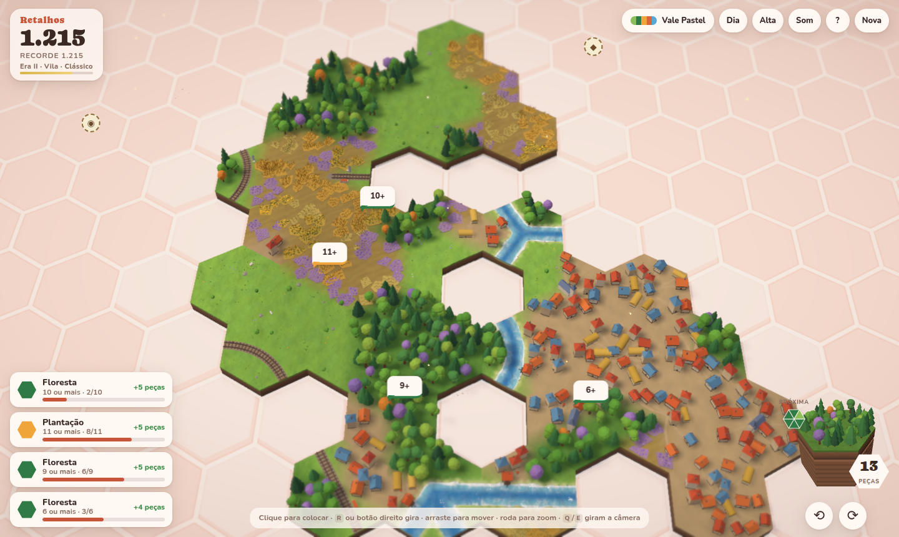 | 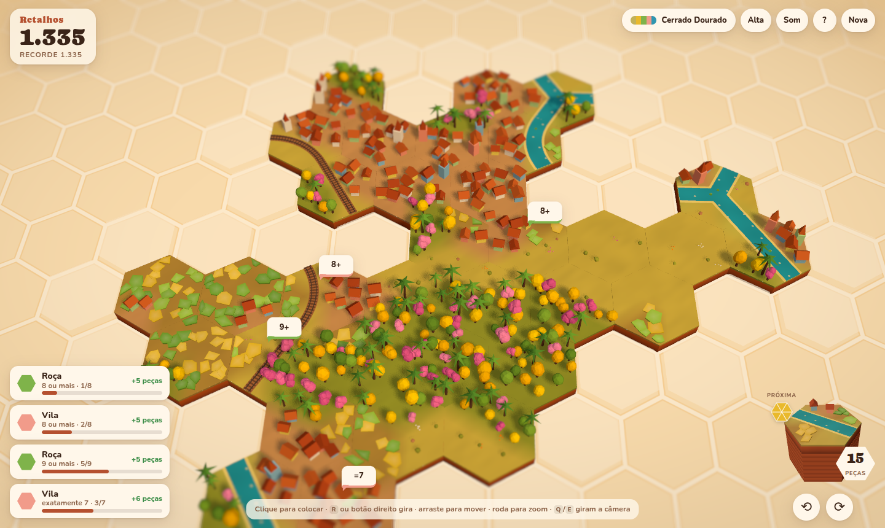 |
| **Jardim Sakura** | **Colônia Marciana** |
| 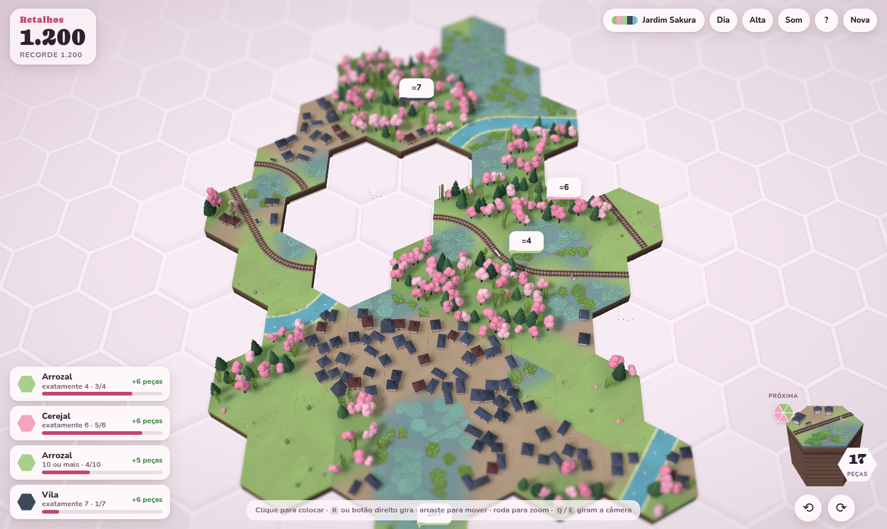 | 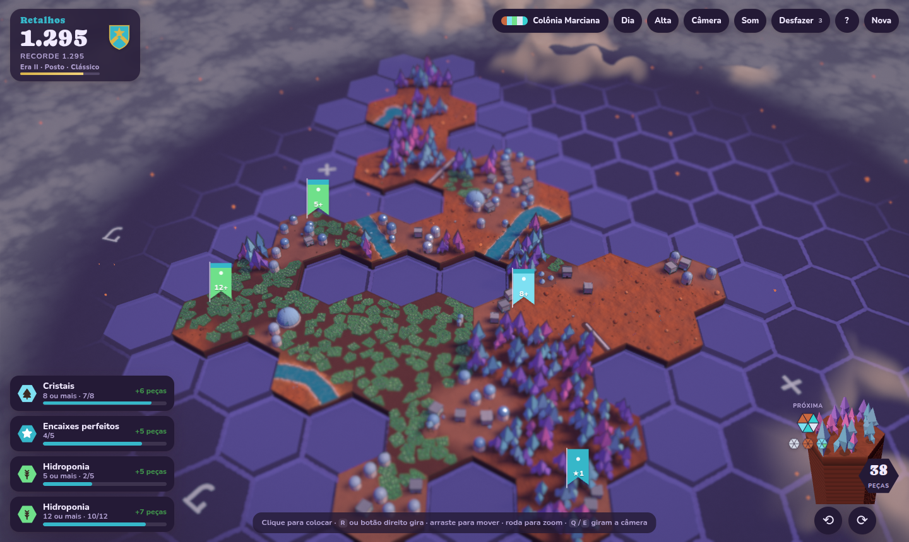 |
| **Inverno Nórdico** | **Celular (390 px)** |
| 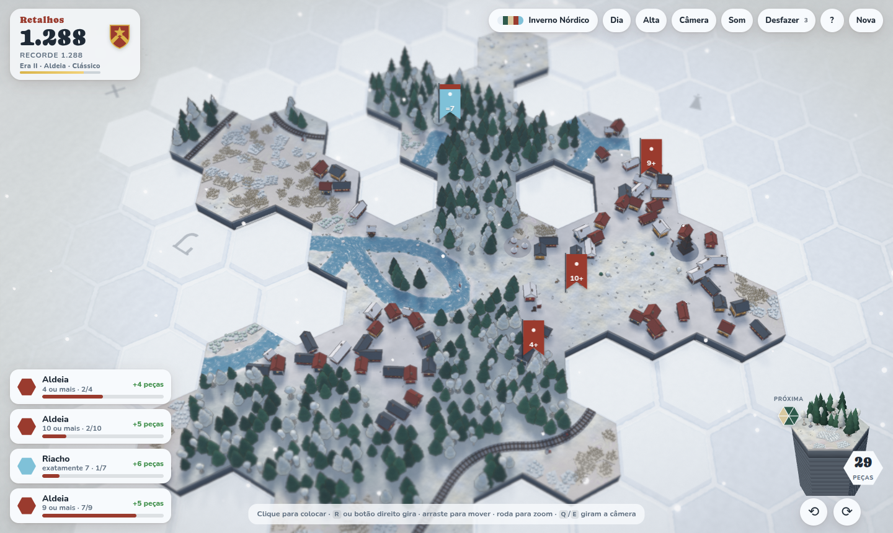 | 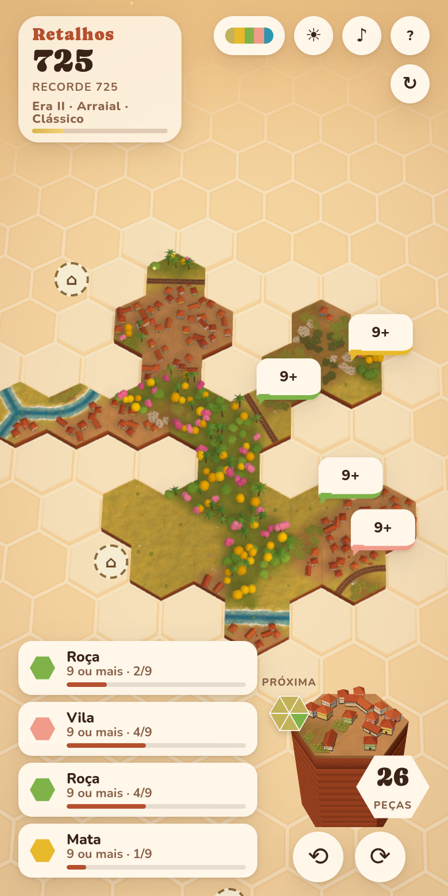 |

Peça flutuando sobre o espaço escolhido antes de encaixar (a sombra e as marcas de borda mostram onde e como ela vai entrar):

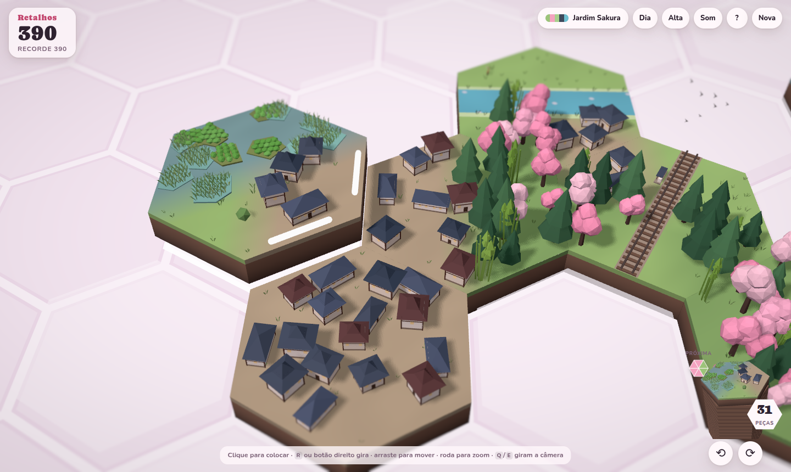

Close com zoom máximo:

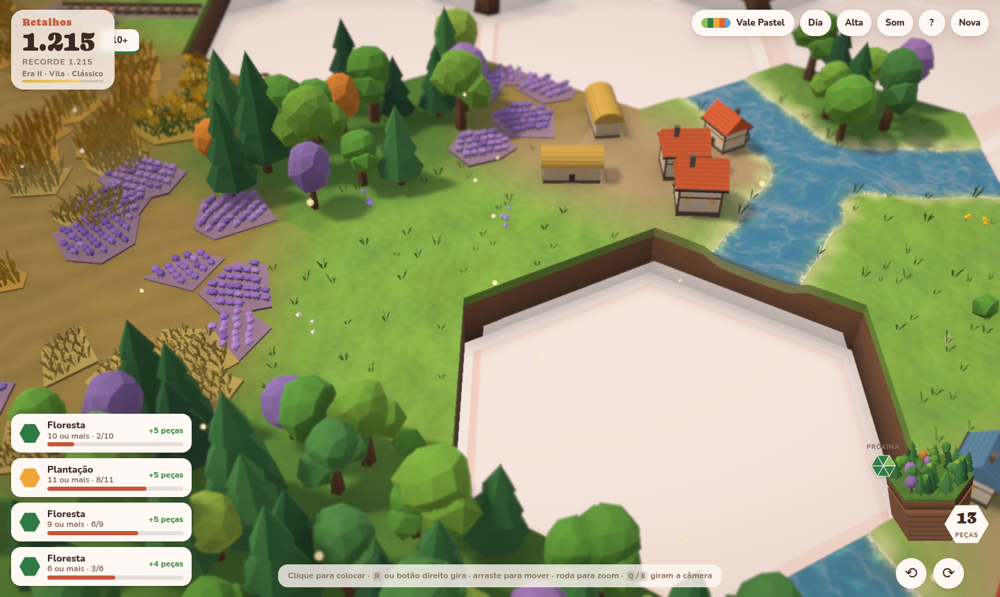

**Onde investir arte de verdade** num produto: modelos autorais para 20 a 40 objetos por tema, em estilo próprio; um contorno suave (rim/fresnel); AO assado; e música. O protótipo prova que a *técnica* não é o gargalo.

---

## 5. Desempenho: roda bem?

### Medições

Teste de carga (`scripts/stress.mjs`): a IA gulosa coloca N peças; depois medimos a cena em 1280×800. As medições foram feitas no **Chromium headless com renderização por software (SwiftShader)**, porque o ambiente não tem GPU. Por isso **o FPS absoluto dessas medições não vale** (fica entre 0 e 5 FPS em software). O que vale são o volume de trabalho enviado à GPU e o custo de CPU.

| Peças | Qualidade | Draw calls | Triângulos/quadro¹ | Instâncias | CPU por quadro² | Montagem inicial | Heap JS |
|---|---|---|---|---|---|---|---|
| 301 | Alta | 61 | 0,62 M | 8,8 mil | 2,7 ms | 116 ms | 26 MB |
| 1.001 | Alta | 86 | 2,17 M | 31 mil | 3,7 ms | 297 ms | 38 MB |
| 2.501 | Alta | 102 | 5,26 M | 78 mil | 6,0 ms | 811 ms | 89 MB |
| 2.501 | Baixa | 90 | 2,93 M | 78 mil | 1,9 ms | 649 ms | 90 MB |

¹ Inclui o passe de sombra. Uma partida normal tem de 150 a 600 peças.
² Tempo da thread principal por quadro (JavaScript + envio de comandos ao WebGL). O orçamento a 60 FPS é 16,7 ms. Com GPU de verdade esse número tende a cair, porque parte do trabalho de software sai da CPU.

**Como ler:**
- **Draw calls ficam baixas em qualquer tamanho** (61 a 102). A meta citada para mobile é ~100 e, para desktop, algumas centenas. O chão é agrupado em blocos de 8×8 peças que só recebem vértices novos, e cada tipo de objeto é um único InstancedMesh.
- **Colocar uma peça é barato**: gerar a geometria leva ~0,3 ms, e as regras (validação, pontuação, grupos, missões) levam 0,14 ms com 300 peças e 1,4 ms com 2.500 (média medida em Node). Não há engasgo ao jogar.
- **Triângulos crescem com o tamanho do mapa** porque a decoração ainda não tem culling por bloco nem LOD. Numa partida típica (0,6 a 1,3 M triângulos com sombra) isso cabe folgado em GPU integrada de desktop. No celular, o perfil Média/Baixa corta sombras e pós-processamento.

### Orçamento por aparelho (estimativa; confirmar em hardware real)

| | Desktop / notebook | Celular intermediário |
|---|---|---|
| Qualidade sugerida | Alta (MSAA 4×, sombra 2048, tilt-shift) | Média (sem pós, sombra 1024, DPR 1,5) ou Baixa |
| Peças confortáveis | 1.000+ | 300 a 600 |
| Maior risco | fill-rate em telas 4K com DPR 2 | fill-rate e aquecimento em sessões longas |

**Para validar de verdade:** rode `npm run dev` e abra `http://localhost:5173/?stress=1000&debug` no computador e no celular (na mesma rede, com `npm run dev -- --host`), e anote o FPS. Durante uma partida normal, a tecla `F` mostra as mesmas estatísticas. Leva poucos minutos e fecha a questão para o hardware que importa.

### Otimizações ainda não feitas (folga disponível)

1. **Culling e LOD da decoração**: dividir os InstancedMesh por super-blocos (16×16) e trocar árvores distantes por versões de 1/4 dos polígonos. Estimativa: 50 a 75% menos triângulos em mapas grandes.
2. **Sombra em cache**: redesenhar o mapa de sombra só quando a câmera se move ou uma peça cai.
3. **Renderizar sob demanda**: em repouso, cair para 30 FPS ou menos (economiza bateria).
4. **Árvores mais leves**: a árvore redonda tem 80 triângulos e a cerejeira, 240. Dá para chegar a 30–60 sem perda visível de qualidade nessa escala.
5. **WebGPU opcional**: manter WebGL2 como padrão. Segundo relatos no fórum do three.js, o WebGPURenderer ainda gasta mais CPU em cenas com muitos objetos.

---

## 6. Adaptação temática

Um tema é **dado, não código**: paleta de cada terreno, nomes, cores da interface, formas das árvores (conífera, redonda, florida, palmeira, cristal), estilo de telhado (duas águas, plano, cúpula, pagode), densidade, luz e, opcionalmente, regras. Trocar de tema reconstrói o mapa em milissegundos, com a mesma partida.

```ts
{
  id: 'cerrado',
  name: 'Cerrado Dourado',
  terrainNames: ['Campo', 'Mata', 'Roça', 'Vila', 'Rio', 'Ferrovia'],
  forest: [
    { geo: 'round',   weight: 0.35, colors: ['#f2c12e', '#f5cf3a'] },  // ipê-amarelo
    { geo: 'blossom', weight: 0.2,  colors: ['#e96fae', '#d85c9e'] },  // ipê-rosa
    { geo: 'palm',    weight: 0.25, colors: ['#4f8a3a', '#5f9a40'] },  // buriti
  ],
  roofStyle: 'gable',
  rules: { perfectBonus: 25 },
  // ...paleta, luz, fundo
}
```

**Temas implementados:** 14. Seis de base (Vale Pastel, Holanda Dourada, Cerrado Dourado, Inverno Nórdico, Jardim Sakura, Colônia Marciana) e oito históricos (Egito do Nilo, Jade Song, Terra dos Vikings, Toscana Renascentista, Andes Incas, Edo Tranquilo, Minas Colonial, Velho Oeste). Veja a seção 13.

**Ideias com twist leve** (da pesquisa, [PESQUISA.md §7](PESQUISA.md)). Todos só recompensam, para manter o clima relaxante:

| Tema | Twist |
|---|---|
| Brasil (Cerrado / Mata Atlântica) | **Aceiro**: isolar mata e roça com prado ou rio rende +1 peça |
| Japão (satoyama) | **Hanami**: a cada 25 peças, as 5 seguintes pontuam mais junto à água |
| Marte | **Terraformação**: encaixes perfeitos "esverdeiam" os vizinhos |
| Fundo do mar | **Profundidade**: multiplicador cresce com a distância ao centro |
| Inverno nórdico | **Lareira**: no inverno, vilas coladas à floresta valem mais |
| Fantasia | **Portais**: ligar dois portais por linhas de ley dá +3 peças |
| Vale do Nilo | **Cheia**: campos junto ao rio valem 2× por algumas rodadas |

Arquiteturalmente, os twists entram como ganchos opcionais do tema (`onPlace`, `onQuestDone`) chamados pelo `Board`, sem mexer no núcleo.

---

## 7. Qual stack usar

Resumo de [PESQUISA.md §3](PESQUISA.md):

| Objetivo | Recomendação |
|---|---|
| Protótipo e vertical slice | **Three.js + TypeScript + Vite** (o deste protótipo). Sem licença, deploy por link e iteração em segundos. |
| Web-first / navegador / itch.io | Three.js. Babylon.js é alternativa se a equipe quiser editor de materiais e inspector. |
| Steam, escopo enxuto | Three.js + Electron + steamworks.js. Funciona, mas exige atenção a overlay, controle e Steam Deck. |
| Steam + consoles + mobile nativo | **Unity 6** (padrão do gênero; Runtime Fee cancelada; Personal gratuito até US$ 200 mil) ou **Godot 4** (MIT, sem royalties). |

Decidir a engine comercial **depois** do vertical slice. Até lá, o núcleo em TS puro mantém a troca barata.

---

## 8. Jurídico e identidade (não é aconselhamento jurídico)

- **Livre:** regras e mecânicas: grade hexagonal, casar bordas, missões, pilha. Nos EUA, 17 U.S.C. §102(b); no Brasil, Lei 9.610/98, art. 8º, II ("regras para jogar"). O próprio gênero vem do dominó, de Carcassonne e de Kingdomino.
- **Arriscado:** copiar a expressão: nome, arte, silhuetas, UI/HUD e o conjunto reconhecível. Precedentes: *Tetris v. Xio* (2012) e *Spry Fox v. 6waves* (2012). Em alguns países mecânicas podem ser **patenteadas** (Nintendo v. Pocketpair); faça busca de anterioridade antes de lançar.
- **No protótipo:** o nome (Retalhos), os modelos, as paletas, os temas e o HUD em cartões laterais são próprios. Antes de um lançamento comercial, vale **afastar mais os marcadores de missão**: hoje são balões com número sobre o grupo, o que lembra as bolhas do original. Trocar por estandartes, ícones temáticos ou um contorno do grupo, por exemplo.
- **Checklist:** registrar a marca (INPI, EUIPO, USPTO); guardar moodboards com referências variadas; usar só assets com licença arquivada; música original; nunca citar "Dorfromantik" em nome, ícone ou loja.

---

## 9. Mercado (dados de agregadores; indicativos)

| Jogo | Preço | Equipe | Resultado estimado |
|---|---|---|---|
| Dorfromantik | ~US$ 14 | 4 pessoas, ~2 anos | ~527 mil cópias na Steam; 96% positivas |
| Islanders | US$ 5 | 3 pessoas, ~7 meses | ~1,3 M de cópias |
| Townscaper | US$ 5 | 1 pessoa | 380 mil na Steam |
| Tiny Glade | US$ 15 | 2 devs, 2+ anos | 616 mil em menos de 1 mês (1,9 M de wishlists) |

O gênero vende, mas metade dos jogos lançados na Steam em 3 anos faturou menos de US$ 500. O que diferencia: identidade forte (um tema brasileiro é um nicho pouco explorado), "delight" em cada interação, demo e wishlists antes do lançamento.

---

## 10. Esforço e roteiro (estimativas)

| Fase | Equipe | Prazo | Entrega |
|---|---|---|---|
| ✅ Protótipo técnico | este repositório | feito | regras, 5 temas, render, medições |
| 1. Protótipo de diversão | 1 dev | 2 a 4 semanas | balanceamento com playtests, bandeiras, 3 próximas peças visíveis, desfazer, peças especiais (moinho, estação, porto) |
| 2. Vertical slice | 1 dev + 1 artista 3D + ½ UI + ¼ som | 8 a 12 semanas | 1 tema polido com arte autoral (40 a 80 objetos), trilha, otimizações da §5, testes em celulares reais |
| 3. Jogo completo (Steam) | 3 a 5 pessoas | 9 a 18 meses | 3+ temas, modos (clássico, criativo, rápido, desafio mensal), conquistas, nuvem, controle/Steam Deck, idiomas |

Custo aproximado (pesquisa, faixa larga): vertical slice de US$ 9 a 48 mil; jogo completo de US$ 72 a 560 mil, dependendo do país e do tamanho da equipe.

---

## 11. Riscos principais

| Risco | Mitigação |
|---|---|
| O loop não "encanta" | Playtests desde já. Todas as constantes já são configuração. Sorteio anti-frustração e botão de desfazer. |
| Desempenho em celulares fracos | Perfis de qualidade (já existem), otimizações da §5 e testes em aparelhos reais |
| Semelhança visual com o original | Arte e HUD autorais e revisão jurídica antes do lançamento |
| Escopo de arte × número de temas | Um tema polido primeiro. Os demais reaproveitam geometria e mudam paleta e formas (o protótipo já funciona assim). |
| Descoberta no mercado | Demo gratuita na web (o formato atual já serve), página na Steam cedo e nicho temático |

---

## 12. Próximos passos sugeridos

1. Abrir `?stress=1000&debug` no seu PC e celular e anotar o FPS.
2. Jogar 3 ou 4 partidas e decidir o que ajustar: tamanho da pilha, bônus, frequência de missões.
3. Escolher o tema-âncora (o Cerrado, por exemplo, é um diferencial de mercado) e o nome definitivo.
4. Implementar bandeiras, desfazer e as 3 próximas peças, e depois peças especiais.
5. Contratar ou definir a direção de arte do tema-âncora.

---

## 13. Evolução v3: temas por época, visual detalhado e interações

**Pedido:** explorar temas de vários países e épocas, um visual mais detalhado e com animações, e interações entre os tipos de conexão, mantendo casa, rio, árvore, campo e plantação (com o trigo balançando ao vento).

**O que mudou:**

- **Temas como kits.** O tema passou a escolher kits de forma (12 árvores, 5 corpos de casa × 9 telhados, com janelas, portas, enxaimel e chaminé; 10 marcos; 15 plantações; 10 animais; 9 barcos; 5 estilos de estrada; 4 veículos) além de cores e nomes. Um agente Sonnet pesquisou e escreveu 8 temas históricos, com as fontes e os anacronismos assumidos em [TEMAS.md](TEMAS.md).
- **Plantações de verdade.** Cada setor de plantação vira parcelas com fileiras de plantas. Um shader desloca as plantas em ondas de vento que atravessam o campo e deixam as pontas mais claras, como trigo balançando. Capim, juncos e flores seguem a mesma ideia.
- **Interações entre tipos de borda** (regra nova, pura, em `src/core/synergy.ts`). Quando bordas comuns diferentes se encostam, o encontro deixa de ser desperdício:

  | Encontro | Efeito |
  |---|---|
  | vila + floresta | +5 e serraria/carpintaria |
  | vila + plantação | +5 e moinho de vento (ou celeiro, conforme o tema) |
  | vila + prado | +5 e pasto com animais |
  | plantação + prado | +5 e colmeias |

  O encaixe continua valendo mais (+10), e o perfeito continua exigindo tudo igual. A interação cria uma segunda camada de decisão ("encosto a vila no trigal para ganhar o moinho?"). A prévia mostra as bordas em dourado e a construção antes de colocar. Dentro da própria peça surgem construções sem pontos: roda d'água (vila na beira do rio), irrigação (plantação ao lado do rio fica mais verde e alta), estação e silo junto da ferrovia.
- **Mundo vivo.** Barcos percorrem a rede de rios, trens, carroças e caravanas seguem estradas e trilhos (fazendo meia-volta nas estações), pás de moinho e rodas d'água giram, animais pastam andando e parando, bandos de pássaros circulam e sombras de nuvens atravessam o mapa.
- **Dia, entardecer e noite**, com transição suave. À noite as janelas acendem.

| Egito do Nilo | Holanda Dourada |
|---|---|
| 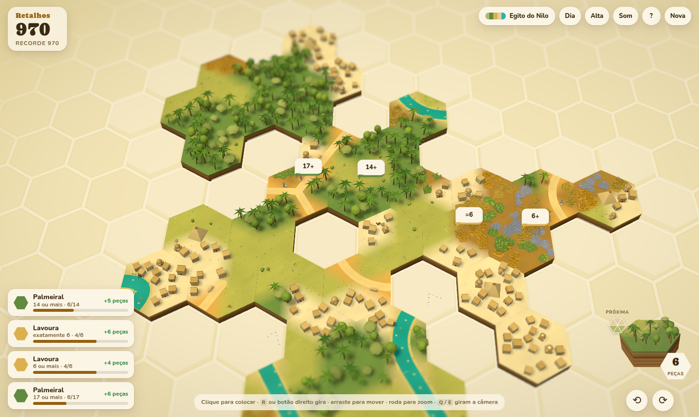 | 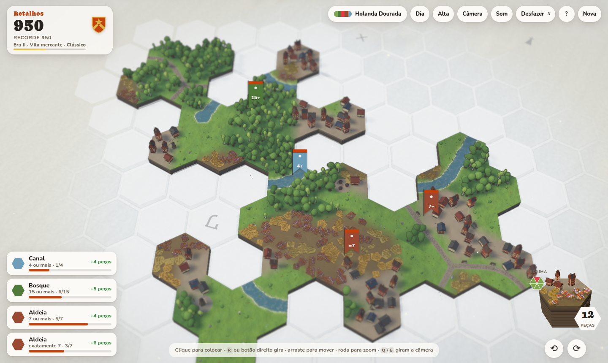 |
| **Minas Colonial** | **Terra dos Vikings** |
| 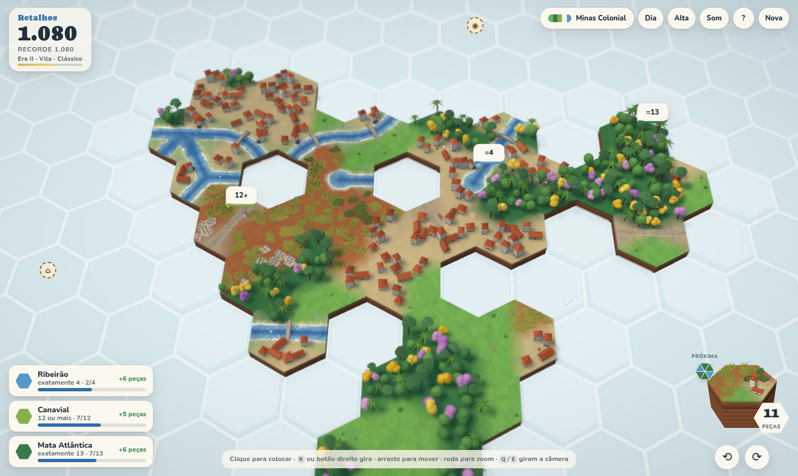 | 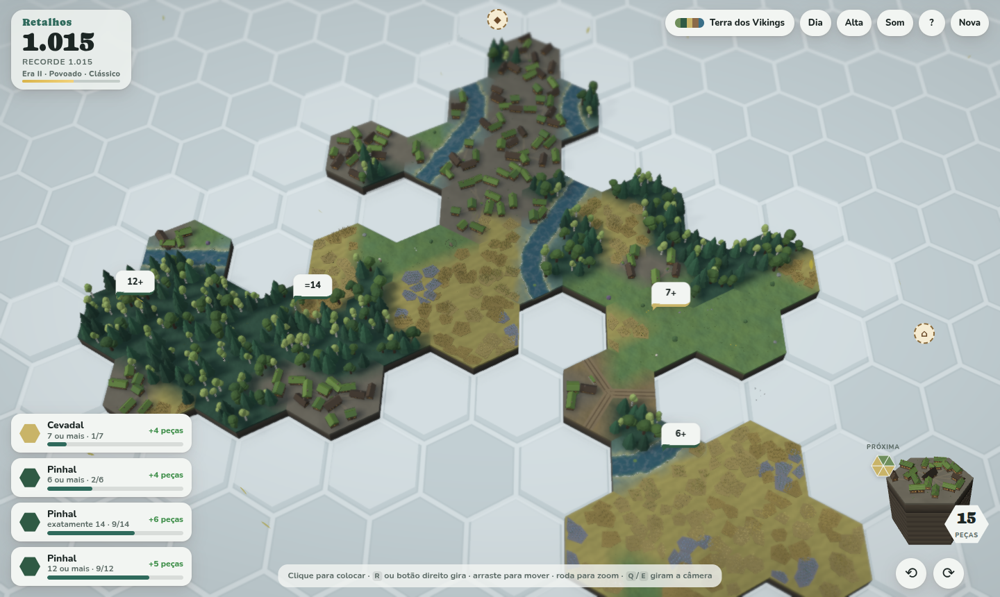 |
| **Velho Oeste** | **Jade Song** |
| 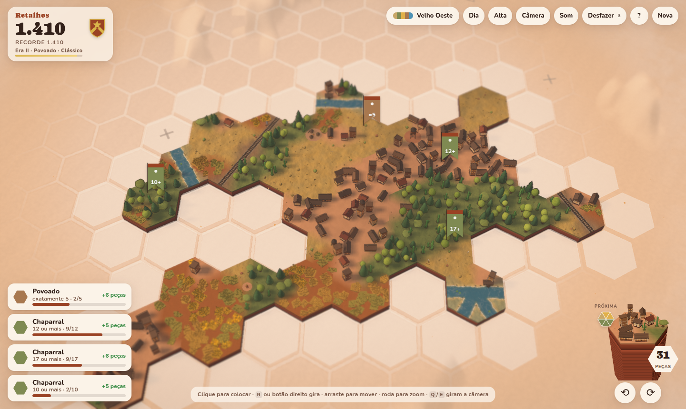 | 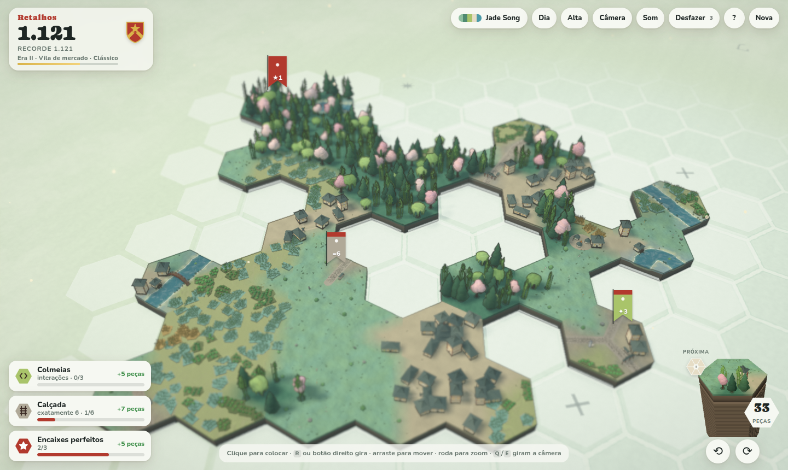 |
| **Trigo, lavanda e girassóis de perto** | **Prévia de interações (bordas douradas e moinho)** |
| 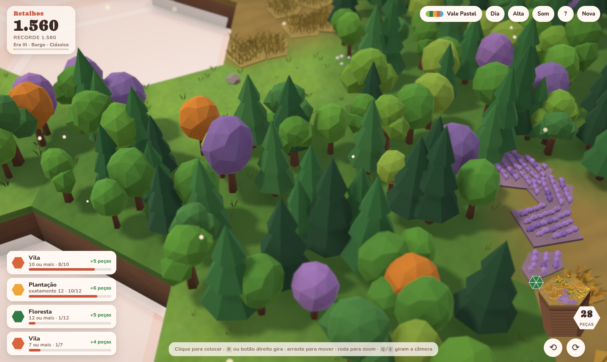 | 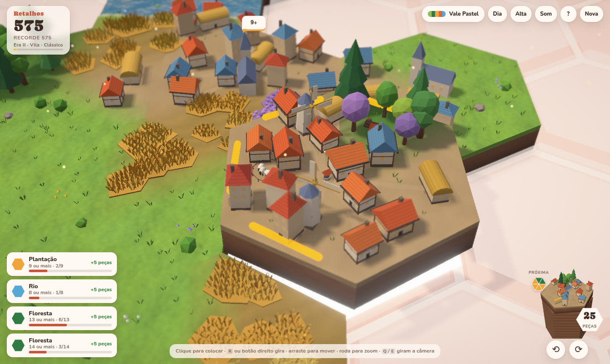 |
| **Noite na Holanda** | **Entardecer na Toscana** |
| 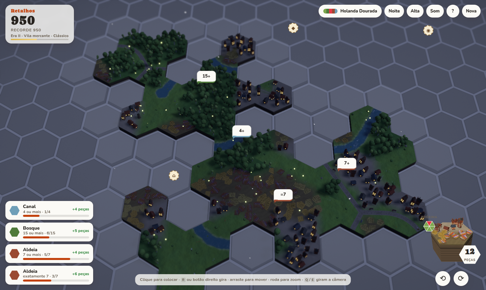 | 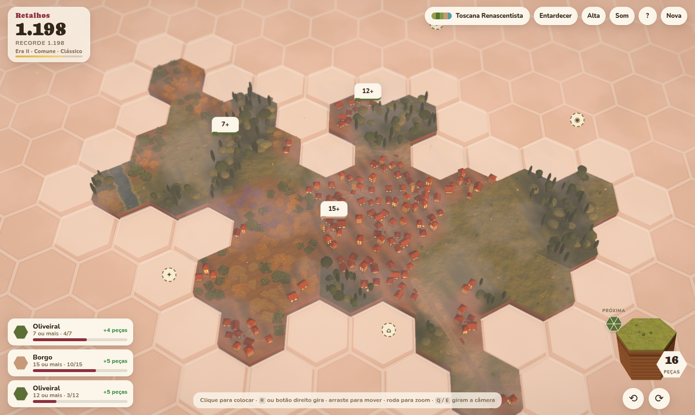 |

Menu de temas agrupado por época e ajuda com a legenda das interações:

| | |
|---|---|
| 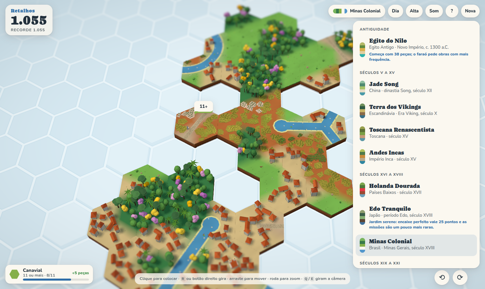 | 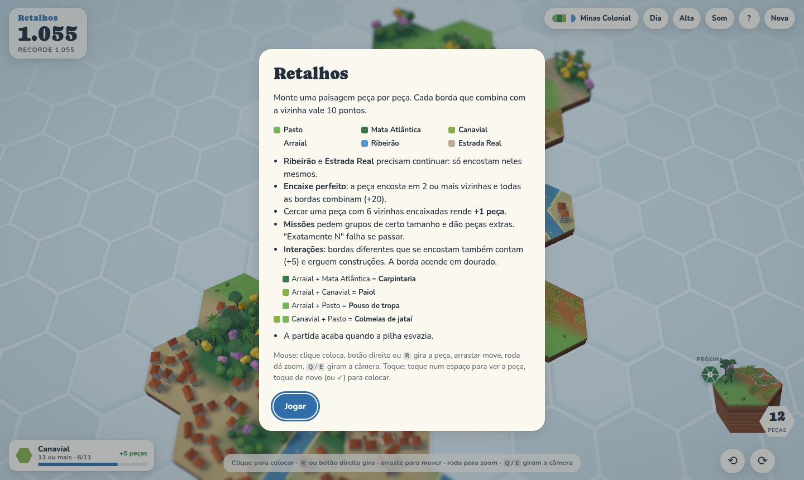 |

### Custo do visual novo

O detalhe tem preço. A primeira medição da v3 mostrou **3,1 M de triângulos por quadro com 300 peças**, cinco vezes a v1, porque a lavanda sozinha somava 800 mil. Depois de medir o custo por kit (`window.__pools()`), aplicamos:

1. geometrias mais leves para lavanda, chá, trigo e girassol, e janelas como planos em vez de caixas;
2. **nível de detalhe por distância:** metade das plantas e do capim fica num segundo grupo, que some quando a câmera se afasta, justamente quando elas ficam minúsculas;
3. a terra das parcelas "puxa" a cor da cultura, então de longe o campo continua dourado, verde ou listrado de tulipas mesmo com menos plantas;
4. plantas e capim não projetam sombra.

| Peças (qualidade alta) | v1: draw calls | v1: triângulos | v3: draw calls | v3: triângulos | v3: CPU por quadro |
|---|---|---|---|---|---|
| 300 | 61 | 0,62 M | 85 | 1,37 M | 4,0 ms |
| 1.000 | 86 | 2,17 M | 123 | 4,55 M | 7,2 ms |
| 2.500 (baixa) | 90 | 2,93 M | 114 | 5,58 M | 6,6 ms |

Medido em renderização por software, como na seção 5. **Leitura:** uma partida típica ficou com cerca do dobro da v1, o que ainda cabe folgado em GPU de desktop. No celular, o modo Auto começa em Média, com metade das plantas e sem sombras. Para mapas muito grandes, o próximo passo é o culling por região da decoração (seção 5, item 1), que ficou mais importante na v3.

### O que falta para os temas ficarem mais fiéis

Na lista priorizada do [TEMAS.md](TEMAS.md), burro/mula e búfalo já entraram (Minas Colonial e Song). Os próximos são ponte em arco sobre rios, torre d'água e moinho-bomba para o Oeste, portais (torii, paifang, portal inca), templos por cultura (pilone egípcio, trapezoidal inca), armazém sobre estacas e as culturas de batata, linho e amoreira.

---

## Apêndice A: revisão de código e QA pelo Sonnet

Um segundo agente (Sonnet) revisou o código sem editá-lo, escreveu testes próprios e reportou achados com cenário de falha e correção sugerida. Todas as correções foram aplicadas e **conferidas de novo com os próprios testes do revisor**.

**O que ele testou:**
- Lógica contra oráculos independentes (BFS de grupos, pontuação recalculada, validade por força bruta): **3.000 partidas e 133.753 jogadas, 0 falhas**. Replay de salvamento: 3.000 completos e 33.000 parciais, 0 divergências.
- Geometria: 7.500 peças e 2 milhões de triângulos, sem NaN, sem triângulo degenerado e sem face invertida. Rotação lógica × render conferida ponta a ponta.
- Memória de GPU: estável em 25 partidas novas e 40 trocas de tema.
- Interface no Chromium: mouse, toque, pinça, teclado, salvamento, 5 temas e dois "testes de caos" de 60 s com 562 ações aleatórias, sem erros de console.

**O que ele encontrou e foi corrigido** (nenhum na lógica de regras; todos na camada de fluxo e interface):

| Severidade | Problema | Correção |
|---|---|---|
| Média | Trocar de tema com o mouse sobre o mapa deixava a peça seguinte com as cores do tema antigo | O fantasma é descartado na troca de tema |
| Média | Um salvamento corrompido travava o jogo em todas as visitas | Salvamento validado e versionado; se o replay não bater com a pontuação salva, começa outra partida com aviso |
| Média | O link `?seed=` era ignorado quando havia partida salva | O link de desafio tem prioridade |
| Média | A mesma semente só dava as mesmas peças enquanto as jogadas fossem idênticas | Cada peça tem gerador próprio (semente + índice): **a mesma semente dá a mesma sequência de peças para qualquer jogador** |
| Média | No celular, pinça sobre o placar dava zoom na página | `touch-action` ajustado na página e nos botões |
| Média | O jogo não iniciava enquanto a folha de fontes do Google estivesse pendurada | Fontes carregadas por script (início em ~0,6 s com a rede presa) |
| Média | Em celular na horizontal, os cartões de missão cobriam o mapa | Largura limitada e no máximo 3 cartões em telas baixas |
| Baixa | Limite de missões simultâneas excedido em 1 | As missões ainda na mão contam no limite |
| Baixa | Árvores e pedras dentro do lago em peças com uma borda de água; retalhos de plantação invadindo rios | Áreas reservadas no gerador (0 ocorrências em 30.000 peças) |
| Baixa | Modal de fim de jogo aparecendo sobre uma partida nova; botão do meio colocando peça; Ctrl/Cmd+R capturado; ajuda reaparecendo depois de fechar com Esc; dica de controles; textos das regras; placar reescrito a cada quadro; sem mensagem quando falta WebGL | Corrigidos um a um |

Também entraram: confirmação antes de descartar uma partida em andamento, qualidade Auto começando em Média em telas de toque, alvo de pós-processamento compatível com GPUs sem suporte a render em ponto flutuante e laço de quadros protegido contra exceções.

## Apêndice B: o que as simulações dizem sobre o balanceamento

Nas 3.000 partidas simuladas, jogadores automáticos que **não** perseguem missões (guloso, aleatório e "pior jogada") duraram em média **40 a 50 peças** e cumpriram **cerca de 0,5 missão por partida**. Um humano que mira as missões vai mais longe. Mesmo assim, é um sinal de que as recompensas atuais (+4 a +6 peças por missão, +1 por peça cercada) talvez sejam avaras para partidas longas e relaxantes como as do gênero. Esse é o primeiro ajuste a testar com jogadores reais, e hoje basta mudar números em `Rules`.
