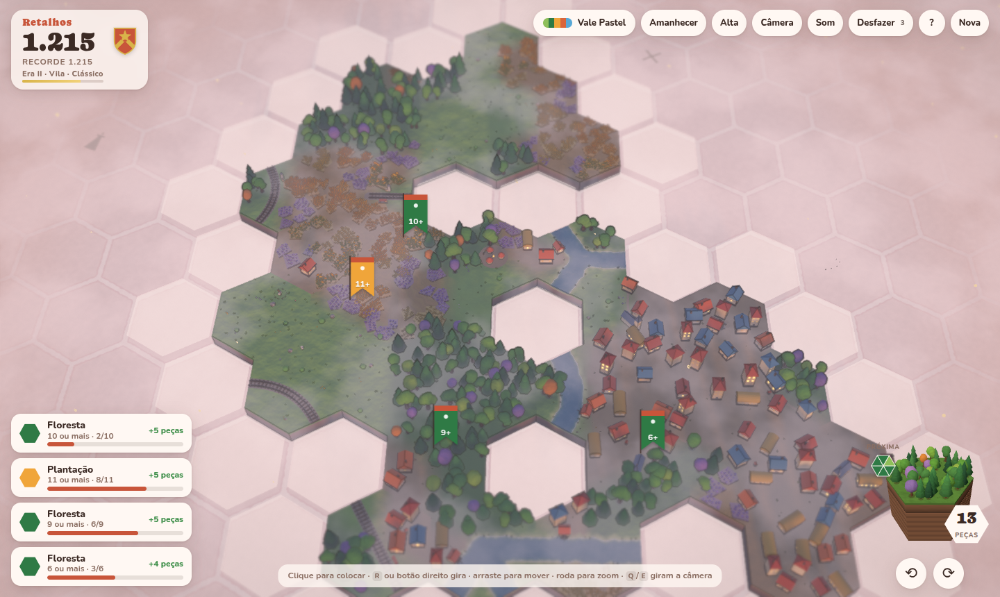
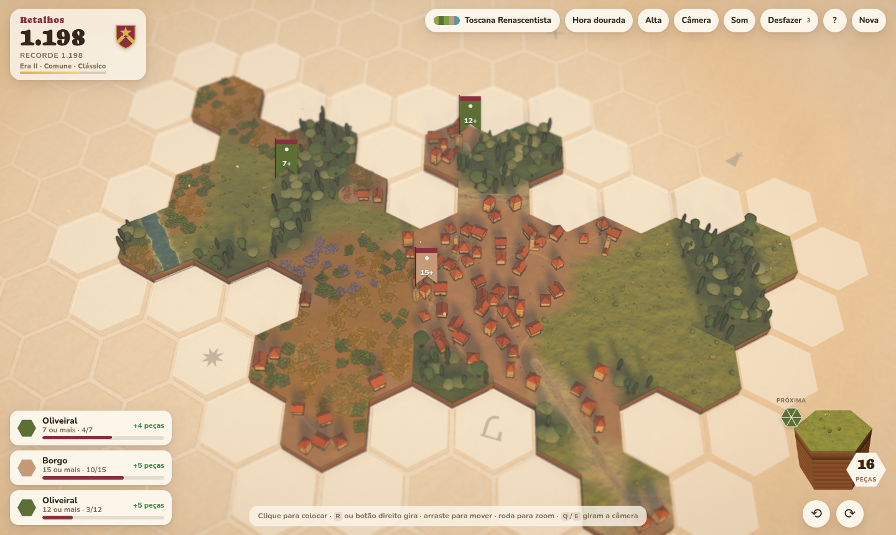
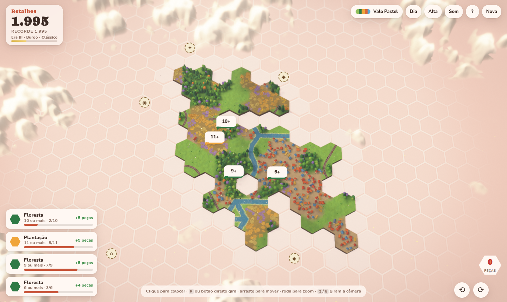

# Retalhos: estudo de viabilidade

**Pergunta:** dá para criar um jogo parecido com Dorfromantik, com tema adaptável, pequenas mudanças de regra e visual próprio, que rode bem, fluido e bonito?

**Resposta curta: sim.** Para não ficar só no papel, construímos um protótipo jogável nesta sessão. Ele tem regras completas, animações, som, suporte a toque e perfis de qualidade automáticos. Na segunda rodada (v3, seção 13) ganhou **14 temas de países e épocas**, construções detalhadas, **interações entre tipos de borda**, trigo que ondula ao vento, barcos, trens, caravanas, animais e ciclo dia/noite. Tudo cabe em um único arquivo HTML de cerca de 700 KB. O risco técnico é baixo. Os riscos reais estão em outro lugar: afinar o "prazer" do loop, dar identidade visual própria (por questões legais e de mercado) e o escopo de arte para vários temas.


Documentos relacionados:
- [PESQUISA.md](PESQUISA.md): pesquisa de apoio com fontes (mecânicas do original, stacks, desempenho, mercado, jurídico, temas, esforço), feita por um agente Sonnet.
- [TEMAS.md](TEMAS.md): pesquisa histórica dos 8 temas de países e épocas (também feita por um agente Sonnet).
- [README.md](../README.md): como rodar, controles e arquitetura do protótipo.

---

## 1. Veredito por dimensão

| Dimensão | Veredito | Evidência |
|---|---|---|
| Regras e loop | ✅ Viável | Implementadas em ~600 linhas de TypeScript puro (`src/core`), sem dependência de renderização, e conferidas em 3.000 partidas simuladas sem falha (Apêndice A). |
| Visual bonito | ✅ Viável | Estilo "diorama" com peças procedurais, sombras suaves, tilt-shift, água animada, vento nas árvores e fumaça. Veja as telas na seção 4. |
| Rodar bem | ✅ Viável, com medição pendente em GPU real | Uma partida típica (300 peças) usa 61 draw calls e 2,7 ms de CPU por quadro, de um orçamento de 16,7 ms. Com 2.500 peças: 102 draw calls e 6 ms. Detalhes na seção 5. |
| Tema adaptável | ✅ Viável e barato | Um tema é um objeto de dados, com cerca de 70 linhas, que escolhe "kits" de forma e cor. Os 14 temas (do Egito Antigo a uma colônia em Marte) usam o mesmo código (seção 13). |
| Pequenas adaptações de regra | ✅ Viável | Todas as constantes estão em `Rules`, e cada tema pode sobrescrevê-las (ex.: Marte começa com 36 peças e recebe mais missões). |
| Jurídico | ⚠️ Cuidado | Regras de jogo não são protegidas, mas nome, arte, UI e "look and feel" podem ser. Seção 8. |
| Mercado | ⚠️ Competitivo | O gênero é provado, mas movido a hits. Seção 9. |

---

## 2. O que o protótipo já faz

**Jogar:** `npm install && npm run dev`, ou abra o `dist/index.html` gerado por `npm run build`. **Testar:** `npm test` simula 600 partidas e confere as regras contra oráculos independentes.

- **Regras completas**: grade hexagonal, 6 tipos de borda, rio e trilho obrigatórios, pontuação por borda, encaixe perfeito, peça "fechada" (6 vizinhos encaixados) que devolve peça à pilha, missões "N ou mais" e "exatamente N" que falham se passarem do alvo, pilha que acaba e fim de jogo. Uma peça que não cabe em lugar nenhum é descartada automaticamente.
- **Visual**: peças geradas proceduralmente a partir das bordas, com rios que fazem curva, lagos, pontes de trilhos com dormentes, retalhos de plantação, bosques, vilas e torres. O vazio tem uma grade hexagonal que desbota, e a névoa acompanha a cor do tema.
- **Sensação ("juice")**: a peça flutua sob o cursor e gira suavemente, as bordas acendem em branco (encaixa) ou vermelho (conflito), a peça assenta com poeira e as árvores balançam ao pousar. Há brilho no encaixe perfeito, pontos flutuantes, contador que rola e sons sintetizados.
- **Temas**: Vale Pastel, Cerrado Dourado, Inverno Nórdico, Jardim Sakura e Colônia Marciana, trocáveis durante a partida.
- **Plataformas**: mouse, teclado e toque (pinça para zoom, toque duplo para colocar). O layout se adapta ao celular.
- **Fluidez**: qualidade Auto/Alta/Média/Baixa. O modo Auto baixa a qualidade sozinho se o quadro passar de ~26 ms.
- **Persistência e desafios**: a partida é salva como semente + lista de jogadas e retomada ao recarregar, com replay determinístico. A mesma semente dá a mesma sequência de peças para qualquer jogador, o que permite desafios por link (`?seed=123`). Também guarda o recorde.
- **Ferramentas de medição**: `?debug` (FPS, draw calls, triângulos), `?stress=2500` (teste de carga), `?auto=40` (tabuleiro pronto), `?demo` (a IA joga sozinha), `?seed=123` (partida reproduzível).

### Arquitetura

```
src/core/     regras puras (hex, peças, tabuleiro, missões, IA gulosa); não importa three.js
src/themes/   temas como dados: paleta, nomes, formas, densidade, regras
src/render/   three.js: gerador procedural de peça, chunks estáticos, instancing, pós-processamento
src/ui/       HUD em HTML/CSS (missões, pilha, avisos, menus)
src/main.ts   entrada, fluxo da partida, salvamento, modos de teste
```

Separar as regras da apresentação é a decisão mais importante: se um dia o jogo migrar para Unity ou Godot, `src/core` vira especificação executável e casos de teste.

---

## 3. Regras: o original e as adaptações

Valores do original segundo guias da comunidade (ver [PESQUISA.md §1](PESQUISA.md)); podem ter mudado em atualizações.

| Regra | Dorfromantik (Classic) | Retalhos (protótipo) |
|---|---|---|
| Pilha inicial | 40 peças | 40 (varia por tema: Inverno 45, Marte 36) |
| Encaixe obrigatório | rio e trilho | rio e trilho (os nomes mudam por tema: canal, ferrovia, maglev) |
| Ponto por borda | +10 | +10 |
| Encaixe perfeito | 6/6 bordas: +60 e +1 peça | todas as bordas **vizinhas** combinam (mínimo 2): +20 (Cerrado: +25) |
| Peça cercada | parte do "perfeito" | peça com 6 vizinhos encaixados: +30 e +1 peça, inclusive peças antigas que você "fecha" |
| Missões | N+ / exatamente N: +100 e +5 peças | N+ / exatamente N: +10×N pontos e +4 a +6 peças |
| Bandeiras, peças especiais, desfazer | sim | ainda não (próximos passos) |

Essas mudanças mostram o que o usuário pediu com "pequenas adaptações": os números são configuração, não código. Ideias de twists por tema estão na seção 6.

---

## 4. Visual: como chegar no "bonito" sem arte feita à mão

O original usa texturas pintadas à mão, vertex color e paletas por bioma (80.lv, 2026). O protótipo chega a um resultado equivalente **sem nenhum arquivo de arte**. Tudo é gerado em código:

| Efeito | Técnica usada | Custo |
|---|---|---|
| Paleta pintada | vertex colors por setor, misturadas nas divisas, mais ruído de "pincelada" no shader, em coordenadas de mundo (sem costuras) | ~0 |
| Relevo de plantações | retalhos poligonais irregulares extrudados, 4 a 6 por setor | geometria estática |
| Rios e lagos | faixas com curva de Bézier entre as bordas, margem clara e água com brilho animado | 1 material |
| Árvores e casas | 14 tipos de objeto low-poly, **um InstancedMesh por tipo** e cor por instância | 1 draw call por tipo |
| Vento | balanço das copas no vertex shader | ~0 |
| Luz | 1 sol com sombra PCF (2048 px) que acompanha a câmera, mais luz hemisférica com as cores do tema | médio |
| Maquete | tilt-shift (2 passes de desfoque) + vinheta + névoa na cor do fundo | baixo |
| Vida | fumaça de chaminé, poeira ao assentar, brilhos | 1 draw call |

| Vale Pastel | Cerrado Dourado |
|---|---|
|  |  |
| **Jardim Sakura** | **Colônia Marciana** |
|  |  |
| **Inverno Nórdico** | **Celular (390 px)** |
|  |  |

Peça flutuando sobre o espaço escolhido antes de encaixar (a sombra e as marcas de borda mostram onde e como ela vai entrar):


Close com zoom máximo:


**Onde investir arte de verdade** num produto: modelos autorais para 20 a 40 objetos por tema, em estilo próprio; um contorno suave (rim/fresnel); AO assado; e música. O protótipo prova que a *técnica* não é o gargalo.

---

## 5. Desempenho: roda bem?

### Medições

Teste de carga (`scripts/stress.mjs`): a IA gulosa coloca N peças; depois medimos a cena em 1280×800. As medições foram feitas no **Chromium headless com renderização por software (SwiftShader)**, porque o ambiente não tem GPU. Por isso **o FPS absoluto dessas medições não vale** (fica entre 0 e 5 FPS em software). O que vale são o volume de trabalho enviado à GPU e o custo de CPU.

| Peças | Qualidade | Draw calls | Triângulos/quadro¹ | Instâncias | CPU por quadro² | Montagem inicial | Heap JS |
|---|---|---|---|---|---|---|---|
| 301 | Alta | 61 | 0,62 M | 8,8 mil | 2,7 ms | 116 ms | 26 MB |
| 1.001 | Alta | 86 | 2,17 M | 31 mil | 3,7 ms | 297 ms | 38 MB |
| 2.501 | Alta | 102 | 5,26 M | 78 mil | 6,0 ms | 811 ms | 89 MB |
| 2.501 | Baixa | 90 | 2,93 M | 78 mil | 1,9 ms | 649 ms | 90 MB |

¹ Inclui o passe de sombra. Uma partida normal tem de 150 a 600 peças.
² Tempo da thread principal por quadro (JavaScript + envio de comandos ao WebGL). O orçamento a 60 FPS é 16,7 ms. Com GPU de verdade esse número tende a cair, porque parte do trabalho de software sai da CPU.

**Como ler:**
- **Draw calls ficam baixas em qualquer tamanho** (61 a 102). A meta citada para mobile é ~100 e, para desktop, algumas centenas. O chão é agrupado em blocos de 8×8 peças que só recebem vértices novos, e cada tipo de objeto é um único InstancedMesh.
- **Colocar uma peça é barato**: gerar a geometria leva ~0,3 ms, e as regras (validação, pontuação, grupos, missões) levam 0,14 ms com 300 peças e 1,4 ms com 2.500 (média medida em Node). Não há engasgo ao jogar.
- **Triângulos crescem com o tamanho do mapa** porque a decoração ainda não tem culling por bloco nem LOD. Numa partida típica (0,6 a 1,3 M triângulos com sombra) isso cabe folgado em GPU integrada de desktop. No celular, o perfil Média/Baixa corta sombras e pós-processamento.

### Orçamento por aparelho (estimativa; confirmar em hardware real)

| | Desktop / notebook | Celular intermediário |
|---|---|---|
| Qualidade sugerida | Alta (MSAA 4×, sombra 2048, tilt-shift) | Média (sem pós, sombra 1024, DPR 1,5) ou Baixa |
| Peças confortáveis | 1.000+ | 300 a 600 |
| Maior risco | fill-rate em telas 4K com DPR 2 | fill-rate e aquecimento em sessões longas |

**Para validar de verdade:** rode `npm run dev` e abra `http://localhost:5173/?stress=1000&debug` no computador e no celular (na mesma rede, com `npm run dev -- --host`), e anote o FPS. Durante uma partida normal, a tecla `F` mostra as mesmas estatísticas. Leva poucos minutos e fecha a questão para o hardware que importa.

### Otimizações ainda não feitas (folga disponível)

1. **Culling e LOD da decoração**: dividir os InstancedMesh por super-blocos (16×16) e trocar árvores distantes por versões de 1/4 dos polígonos. Estimativa: 50 a 75% menos triângulos em mapas grandes.
2. **Sombra em cache**: redesenhar o mapa de sombra só quando a câmera se move ou uma peça cai.
3. **Renderizar sob demanda**: em repouso, cair para 30 FPS ou menos (economiza bateria).
4. **Árvores mais leves**: a árvore redonda tem 80 triângulos e a cerejeira, 240. Dá para chegar a 30–60 sem perda visível de qualidade nessa escala.
5. **WebGPU opcional**: manter WebGL2 como padrão. Segundo relatos no fórum do three.js, o WebGPURenderer ainda gasta mais CPU em cenas com muitos objetos.

---

## 6. Adaptação temática

Um tema é **dado, não código**: paleta de cada terreno, nomes, cores da interface, formas das árvores (conífera, redonda, florida, palmeira, cristal), estilo de telhado (duas águas, plano, cúpula, pagode), densidade, luz e, opcionalmente, regras. Trocar de tema reconstrói o mapa em milissegundos, com a mesma partida.

```ts
{
  id: 'cerrado',
  name: 'Cerrado Dourado',
  terrainNames: ['Campo', 'Mata', 'Roça', 'Vila', 'Rio', 'Ferrovia'],
  forest: [
    { geo: 'round',   weight: 0.35, colors: ['#f2c12e', '#f5cf3a'] },  // ipê-amarelo
    { geo: 'blossom', weight: 0.2,  colors: ['#e96fae', '#d85c9e'] },  // ipê-rosa
    { geo: 'palm',    weight: 0.25, colors: ['#4f8a3a', '#5f9a40'] },  // buriti
  ],
  roofStyle: 'gable',
  rules: { perfectBonus: 25 },
  // ...paleta, luz, fundo
}
```

**Temas implementados:** 14. Seis de base (Vale Pastel, Holanda Dourada, Cerrado Dourado, Inverno Nórdico, Jardim Sakura, Colônia Marciana) e oito históricos (Egito do Nilo, Jade Song, Terra dos Vikings, Toscana Renascentista, Andes Incas, Edo Tranquilo, Minas Colonial, Velho Oeste). Veja a seção 13.

**Ideias com twist leve** (da pesquisa, [PESQUISA.md §7](PESQUISA.md)). Todos só recompensam, para manter o clima relaxante:

| Tema | Twist |
|---|---|
| Brasil (Cerrado / Mata Atlântica) | **Aceiro**: isolar mata e roça com prado ou rio rende +1 peça |
| Japão (satoyama) | **Hanami**: a cada 25 peças, as 5 seguintes pontuam mais junto à água |
| Marte | **Terraformação**: encaixes perfeitos "esverdeiam" os vizinhos |
| Fundo do mar | **Profundidade**: multiplicador cresce com a distância ao centro |
| Inverno nórdico | **Lareira**: no inverno, vilas coladas à floresta valem mais |
| Fantasia | **Portais**: ligar dois portais por linhas de ley dá +3 peças |
| Vale do Nilo | **Cheia**: campos junto ao rio valem 2× por algumas rodadas |

Arquiteturalmente, os twists entram como ganchos opcionais do tema (`onPlace`, `onQuestDone`) chamados pelo `Board`, sem mexer no núcleo.

---

## 7. Qual stack usar

Resumo de [PESQUISA.md §3](PESQUISA.md):

| Objetivo | Recomendação |
|---|---|
| Protótipo e vertical slice | **Three.js + TypeScript + Vite** (o deste protótipo). Sem licença, deploy por link e iteração em segundos. |
| Web-first / navegador / itch.io | Three.js. Babylon.js é alternativa se a equipe quiser editor de materiais e inspector. |
| Steam, escopo enxuto | Three.js + Electron + steamworks.js. Funciona, mas exige atenção a overlay, controle e Steam Deck. |
| Steam + consoles + mobile nativo | **Unity 6** (padrão do gênero; Runtime Fee cancelada; Personal gratuito até US$ 200 mil) ou **Godot 4** (MIT, sem royalties). |

Decidir a engine comercial **depois** do vertical slice. Até lá, o núcleo em TS puro mantém a troca barata.

---

## 8. Jurídico e identidade (não é aconselhamento jurídico)

- **Livre:** regras e mecânicas: grade hexagonal, casar bordas, missões, pilha. Nos EUA, 17 U.S.C. §102(b); no Brasil, Lei 9.610/98, art. 8º, II ("regras para jogar"). O próprio gênero vem do dominó, de Carcassonne e de Kingdomino.
- **Arriscado:** copiar a expressão: nome, arte, silhuetas, UI/HUD e o conjunto reconhecível. Precedentes: *Tetris v. Xio* (2012) e *Spry Fox v. 6waves* (2012). Em alguns países mecânicas podem ser **patenteadas** (Nintendo v. Pocketpair); faça busca de anterioridade antes de lançar.
- **No protótipo:** o nome (Retalhos), os modelos, as paletas, os temas e o HUD em cartões laterais são próprios. Antes de um lançamento comercial, vale **afastar mais os marcadores de missão**: hoje são balões com número sobre o grupo, o que lembra as bolhas do original. Trocar por estandartes, ícones temáticos ou um contorno do grupo, por exemplo.
- **Checklist:** registrar a marca (INPI, EUIPO, USPTO); guardar moodboards com referências variadas; usar só assets com licença arquivada; música original; nunca citar "Dorfromantik" em nome, ícone ou loja.

---

## 9. Mercado (dados de agregadores; indicativos)

| Jogo | Preço | Equipe | Resultado estimado |
|---|---|---|---|
| Dorfromantik | ~US$ 14 | 4 pessoas, ~2 anos | ~527 mil cópias na Steam; 96% positivas |
| Islanders | US$ 5 | 3 pessoas, ~7 meses | ~1,3 M de cópias |
| Townscaper | US$ 5 | 1 pessoa | 380 mil na Steam |
| Tiny Glade | US$ 15 | 2 devs, 2+ anos | 616 mil em menos de 1 mês (1,9 M de wishlists) |

O gênero vende, mas metade dos jogos lançados na Steam em 3 anos faturou menos de US$ 500. O que diferencia: identidade forte (um tema brasileiro é um nicho pouco explorado), "delight" em cada interação, demo e wishlists antes do lançamento.

---

## 10. Esforço e roteiro (estimativas)

| Fase | Equipe | Prazo | Entrega |
|---|---|---|---|
| ✅ Protótipo técnico | este repositório | feito | regras, 5 temas, render, medições |
| 1. Protótipo de diversão | 1 dev | 2 a 4 semanas | balanceamento com playtests, bandeiras, 3 próximas peças visíveis, desfazer, peças especiais (moinho, estação, porto) |
| 2. Vertical slice | 1 dev + 1 artista 3D + ½ UI + ¼ som | 8 a 12 semanas | 1 tema polido com arte autoral (40 a 80 objetos), trilha, otimizações da §5, testes em celulares reais |
| 3. Jogo completo (Steam) | 3 a 5 pessoas | 9 a 18 meses | 3+ temas, modos (clássico, criativo, rápido, desafio mensal), conquistas, nuvem, controle/Steam Deck, idiomas |

Custo aproximado (pesquisa, faixa larga): vertical slice de US$ 9 a 48 mil; jogo completo de US$ 72 a 560 mil, dependendo do país e do tamanho da equipe.

---

## 11. Riscos principais

| Risco | Mitigação |
|---|---|
| O loop não "encanta" | Playtests desde já. Todas as constantes já são configuração. Sorteio anti-frustração e botão de desfazer. |
| Desempenho em celulares fracos | Perfis de qualidade (já existem), otimizações da §5 e testes em aparelhos reais |
| Semelhança visual com o original | Arte e HUD autorais e revisão jurídica antes do lançamento |
| Escopo de arte × número de temas | Um tema polido primeiro. Os demais reaproveitam geometria e mudam paleta e formas (o protótipo já funciona assim). |
| Descoberta no mercado | Demo gratuita na web (o formato atual já serve), página na Steam cedo e nicho temático |

---

## 12. Próximos passos sugeridos

1. Abrir `?stress=1000&debug` no seu PC e celular e anotar o FPS.
2. Jogar 3 ou 4 partidas e decidir o que ajustar: tamanho da pilha, bônus, frequência de missões.
3. Escolher o tema-âncora (o Cerrado, por exemplo, é um diferencial de mercado) e o nome definitivo.
4. Implementar bandeiras, desfazer e as 3 próximas peças, e depois peças especiais.
5. Contratar ou definir a direção de arte do tema-âncora.

---

## 13. Evolução v3: temas por época, visual detalhado e interações

**Pedido:** explorar temas de vários países e épocas, um visual mais detalhado e com animações, e interações entre os tipos de conexão, mantendo casa, rio, árvore, campo e plantação (com o trigo balançando ao vento).

**O que mudou:**

- **Temas como kits.** O tema passou a escolher kits de forma (12 árvores, 5 corpos de casa × 9 telhados, com janelas, portas, enxaimel e chaminé; 10 marcos; 15 plantações; 10 animais; 9 barcos; 5 estilos de estrada; 4 veículos) além de cores e nomes. Um agente Sonnet pesquisou e escreveu 8 temas históricos, com as fontes e os anacronismos assumidos em [TEMAS.md](TEMAS.md).
- **Plantações de verdade.** Cada setor de plantação vira parcelas com fileiras de plantas. Um shader desloca as plantas em ondas de vento que atravessam o campo e deixam as pontas mais claras, como trigo balançando. Capim, juncos e flores seguem a mesma ideia.
- **Interações entre tipos de borda** (regra nova, pura, em `src/core/synergy.ts`). Quando bordas comuns diferentes se encostam, o encontro deixa de ser desperdício:

  | Encontro | Efeito |
  |---|---|
  | vila + floresta | +5 e serraria/carpintaria |
  | vila + plantação | +5 e moinho de vento (ou celeiro, conforme o tema) |
  | vila + prado | +5 e pasto com animais |
  | plantação + prado | +5 e colmeias |

  O encaixe continua valendo mais (+10), e o perfeito continua exigindo tudo igual. A interação cria uma segunda camada de decisão ("encosto a vila no trigal para ganhar o moinho?"). A prévia mostra as bordas em dourado e a construção antes de colocar. Dentro da própria peça surgem construções sem pontos: roda d'água (vila na beira do rio), irrigação (plantação ao lado do rio fica mais verde e alta), estação e silo junto da ferrovia.
- **Mundo vivo.** Barcos percorrem a rede de rios, trens, carroças e caravanas seguem estradas e trilhos (fazendo meia-volta nas estações), pás de moinho e rodas d'água giram, animais pastam andando e parando, bandos de pássaros circulam e sombras de nuvens atravessam o mapa.
- **Dia, entardecer e noite**, com transição suave. À noite as janelas acendem.

| Egito do Nilo | Holanda Dourada |
|---|---|
|  |  |
| **Minas Colonial** | **Terra dos Vikings** |
|  |  |
| **Velho Oeste** | **Jade Song** |
|  |  |
| **Trigo, lavanda e girassóis de perto** | **Prévia de interações (bordas douradas e moinho)** |
|  |  |
| **Noite na Holanda** | **Entardecer na Toscana** |
|  |  |

Menu de temas agrupado por época e ajuda com a legenda das interações:

| | |
|---|---|
|  |  |

### Custo do visual novo

O detalhe tem preço. A primeira medição da v3 mostrou **3,1 M de triângulos por quadro com 300 peças**, cinco vezes a v1, porque a lavanda sozinha somava 800 mil. Depois de medir o custo por kit (`window.__pools()`), aplicamos:

1. geometrias mais leves para lavanda, chá, trigo e girassol, e janelas como planos em vez de caixas;
2. **nível de detalhe por distância:** metade das plantas e do capim fica num segundo grupo, que some quando a câmera se afasta, justamente quando elas ficam minúsculas;
3. a terra das parcelas "puxa" a cor da cultura, então de longe o campo continua dourado, verde ou listrado de tulipas mesmo com menos plantas;
4. plantas e capim não projetam sombra.

| Peças (qualidade alta) | v1: draw calls | v1: triângulos | v3: draw calls | v3: triângulos | v3: CPU por quadro |
|---|---|---|---|---|---|
| 300 | 61 | 0,62 M | 85 | 1,37 M | 4,0 ms |
| 1.000 | 86 | 2,17 M | 123 | 4,55 M | 7,2 ms |
| 2.500 (baixa) | 90 | 2,93 M | 114 | 5,58 M | 6,6 ms |

Medido em renderização por software, como na seção 5. **Leitura:** uma partida típica ficou com cerca do dobro da v1, o que ainda cabe folgado em GPU de desktop. No celular, o modo Auto começa em Média, com metade das plantas e sem sombras. Para mapas muito grandes, o próximo passo é o culling por região da decoração (seção 5, item 1), que ficou mais importante na v3.

### O que falta para os temas ficarem mais fiéis

Na lista priorizada do [TEMAS.md](TEMAS.md), burro/mula e búfalo já entraram (Minas Colonial e Song). Os próximos são ponte em arco sobre rios, torre d'água e moinho-bomba para o Oeste, portais (torii, paifang, portal inca), templos por cultura (pilone egípcio, trapezoidal inca), armazém sobre estacas e as culturas de batata, linho e amoreira.

---

---

## 14. Evolução v4: polimento visual máximo e mecânicas novas

**Pedido:** testar o máximo de polimento visual possível (animação, serrilhado, qualidade de pixel, gráficos), mesmo migrando de tecnologia, e ter liberdade para mudar, aprofundar e criar versões alternativas das regras. Um agente em paralelo pesquisou Age of Empires em busca de ideias ([IDEIAS_AOE.md](IDEIAS_AOE.md)).

**Decisão de tecnologia.** Migramos do `WebGLRenderer` para o **`WebGPURenderer` do three.js r186**, com materiais em TSL. Onde o navegador não tem WebGPU, o three usa WebGL2 sozinho, com os mesmos materiais. Trocar de engine (Unity, Godot, Babylon) não traria um teto visual maior para arte procedural e perderia o HTML único. O que o WebGPU destrava:

| Recurso | Como entrou |
|---|---|
| Oclusão ambiente (GTAO) | normais na mesma passada (MRT), filtro de ruído que respeita profundidade |
| Antisserrilhado temporal (TRAA) | vetores de movimento corretos inclusive para o vento nas plantas (`positionPrevious`) |
| Profundidade de campo real | foco no ponto que a câmera olha: efeito maquete sem a faixa fixa do tilt-shift antigo |
| Bloom | janelas acesas, cintilar do sol na água, faíscas |
| Luz por imagem (IBL) | céu procedural refeito quando a hora do dia muda |
| Sombras suaves | filtro próprio 4×4 com comparação bilinear (o PCF padrão deixava ruído fixo) |

**Visual novo:**
- rios com leito escavado, margens inclinadas e onduladas, cor por profundidade, espuma, correnteza que desce de peça em peça e cintilar do sol;
- chão com detalhe por terreno (manchas no prado, folhas na mata, sulcos na terra, pedrinhas na vila), laterais com estratos;
- vilas com terra batida, trilhas até uma praça e poço; telhados com fiadas de telha e beiral;
- clima por tema no shader (neve, pétalas, folhas, poeira, pólen), vaga-lumes à noite, fumaça e poeira em sprites macios;
- onda no chão quando a peça assenta, quique, fantasma que inclina, construções de interação que sobem com som de martelo.

**Mecânicas novas** (todas com oráculo independente nos testes): eras da vila (+3 peças por era), sítios escondidos (ruína, tesouro, relíquia, mirante), bônus de "civilização" por tema, desfazer e quatro modos (Clássico, Zen, Desafio do dia, Exploradores). Save v4.

**Custo.** Com 300 peças em renderização por software: 106 draw calls (+11%) e 1,45 M de triângulos (+6%) no perfil Alta. A CPU por quadro medida no SwiftShader subiu, mas o profiler mostra quase tudo em escrita de buffers e envio de comandos disputando CPU com o rasterizador por software. **A medição em GPU real (`?stress=1000&debug`) continua sendo o próximo passo**; o modo Auto desce de Ultra para Alta, Média e Baixa se o quadro passar de ~26 ms.

### Ultra além do PC de hoje (outubro de 2026)

O Ultra deixou de ser medido pelo PC atual (RX 580, que fica em Média com 1.000 peças em 4K): o alvo é a máxima qualidade numa GPU melhor. Alta, Média e Baixa não mudaram, e o Auto continua descendo de nível sozinho.

| Recurso (só no Ultra) | Como entrou |
|---|---|
| Sombras em cascata | `CSMShadowNode` com 3 cascatas de 4096², divididas em volta do alvo da câmera (que olha de cima: perto dela só há ar) |
| Reflexos na água (SSR) | só onde a água grava a máscara própria (`ssrMask`, no alfa da saída de normal, onde os outros materiais gravam a rugosidade); a normal do reflexo é acalmada para os raios não se espalharem nas ondas |
| Luz indireta (SSGI) | substitui o GTAO: oclusão mais a cor que rebate das superfícies vizinhas, somada só onde há oclusão (no chão aberto e ondulado ela apagava as sombras longas do entardecer); o vazio fica fora da cor difusa |
| Raios de luz (godrays) | percorrem o mapa de sombra de uma luz sem intensidade (as cascatas não têm mapa único); só aparecem com o sol baixo |
| Vegetação mais densa | detalhe 1,35 (Alta segue em 1) |

**Armadilhas:**
- O WebGPU limita a 32 bytes por amostra o total das saídas da passada (cada RGBA8 conta 8). Cor, normal, difusa e velocidade já ocupam tudo, por isso a rugosidade vai no alfa da normal.
- Numa MRT, só a saída `output` usa a mistura do material; as outras são sobrescritas até por partículas transparentes, que deixavam quadrados na oclusão. A normal e a difusa usam `setBlendMode(..., MaterialBlending)`, e os materiais transparentes gravam nelas com alfa 0.

**Custo.** Com 300 peças em renderização por software: Ultra com 193 draw calls e 3,05 M de triângulos, contra 111 e 1,53 M na Alta. O dobro de triângulos vem das passadas de sombra extras (3 cascatas mais a luz dos raios) e de 35% mais decoração. O custo real em GPU ainda precisa ser medido; `?fx=gi.ssr.rays.traa` liga os efeitos um a um.

### Água física (outubro de 2026)

A água deixou de ser uma faixa pintada sobre o leito e virou uma coluna d'água: o olhar atravessa a superfície e vê o fundo. Vale em todos os níveis de qualidade; o reflexo de tela continua só no Ultra.

| Recurso | Como entrou |
|---|---|
| Leito visível | a malha da água repete os triângulos do leito que ficam abaixo da linha d'água, com a cor e a profundidade exata de cada vértice (`wbed`); a beira fica onde a profundidade zera, sem a faixa de espuma que escondia a emenda |
| Cor por absorção | o olhar refrata (n = 1,333) e cada canal é absorvido no caminho do sol até o leito e na volta; a absorção vem da cor da água do tema, então cada tema mantém a sua água, e o que a coluna absorve vira a cor turva da água funda |
| Cáusticas | 32 quadros de 128² (512 KB) calculados por traçado de fótons num Web Worker, periódicos no espaço e no tempo; o shader interpola os quadros e mistura duas fases da correnteza sem perder contraste; multiplicam só a luz direta, então somem na sombra e à noite |
| Reflexo estável | Fresnel exato de dielétrico para o céu; o brilho do sol é o GGX da própria luz, com a rugosidade alargada pela variação das ondas dentro do pixel (filtro de Kaplanyan e Tokuyoshi): de longe vira um caminho de luz que não pisca |
| Esteiras e anéis | barcos andando deixam os braços do V de Kelvin, ondas transversais e espuma no casco (até 8, os mais perto do foco da câmera); peixes abrem anéis de tempos em tempos; a peça que assenta faz ondinhas na água |

**Armadilhas:**
- O Dawn (testado com SwiftShader) recusa o envio fatia por fatia de uma textura 3D ("TextureViewDimension e2D not compatible with e3D"). As cáusticas usam uma textura em camadas (`DataArrayTexture`) e o shader interpola entre duas camadas.
- O cálculo das cáusticas leva ~150 ms; na thread principal, sob render por software, ele travava a abertura. Vai num Web Worker criado do texto da própria função, que por isso não pode depender de nada de fora. Sem worker (uma política de conteúdo que bloqueie `blob:`), roda na thread principal logo depois da abertura.
- O SSR reconhecia a água pela rugosidade baixa. Com o filtro de Kaplanyan, a rugosidade da água sobe com a distância, então a água grava uma máscara própria no lugar dela.

**Custo.** Com 300 peças em renderização por software, os draw calls não mudam (193 no Ultra, 111 na Alta) e os triângulos sobem 0,3% no Ultra (3,06 M) e 0,7% na Alta (1,54 M), porque a água agora segue a grade do leito. A montagem das peças fica ~15% mais lenta, já que a correnteza é calculada em mais vértices. A CPU por quadro ficou dentro do ruído do SwiftShader, que dá picos de ~1 s nos dois builds. O shader da água ficou mais pesado (12 leituras de textura por pixel de água, contra 3); esse custo só uma GPU de verdade mede.

### Acabamento (outubro de 2026)

Cinco ajustes de imagem do estudo da Lagoa e do Threetopia, quase sem custo na placa.

| Recurso | Como entrou |
|---|---|
| Oclusão só na luz indireta | os materiais do jogo (`LitMaterial`: kits, chão e água) gravam no passe da cena a parte da cor que veio do céu (`indirectShare`), e o pós escurece só essa parte. O sol direto, as janelas acesas, o contorno das copas e a névoa não ganham mais halo escuro. Na Alta, o GTAO ganha o rebatimento colorido de Jimenez (2016): o pé da grama fica verde-escuro, não cinza. No Ultra, o próprio SSGI já traz a luz rebatida |
| Nitidez e faixas | o RCAS (`SharpenNode`) depois do TRAA devolve o detalhe que a média temporal amolece, sem realçar o ruído do SSGI; um dither triangular de ±1 nível, depois da conversão para sRGB, tira as faixas do céu e da névoa |
| Cor por hora | a gradação puxa os realces para a cor do sol e as sombras para o tom oposto: quase nada ao meio-dia, realce dourado e sombra azulada no entardecer, nada à noite. O tom sai da cor do sol de cada tema, sem regra por tema |
| Sombra firme | sem cascatas (Alta e abaixo), o centro da sombra anda de texel em texel no plano da luz, e as bordas não tremem quando a câmera desliza; as cascatas do Ultra já faziam isso |
| Capim sem pipocar | a metade fina das plantas (chaves `~`) não some mais de uma vez em `rig.dist` 13: entre 11,5 e 14,5, cada planta afunda no chão na sua vez (material `cropFine`, sem `discard`) |

**Armadilhas:**
- O `builtinAOContext` do three aplica a oclusão dentro do material, mas pede um pré-passe de profundidade e normal, o que dobra os draw calls. Gravar a parte indireta numa saída do passe da cena dá o mesmo resultado sem passe extra. Ela vai no alfa da saída `diffuse` (Ultra) ou da `normal` (Alta, que não grava a máscara do reflexo).
- Com SSGI, o vazio grava a cor difusa zerada, para não tingir a luz rebatida. O alfa dessa saída precisa ser 1; com 0, o vazio perde a oclusão e o fundo entre as peças clareia.
- O dither precisa vir depois da conversão para sRGB, então o pipeline faz a conversão no próprio grafo (`outputColorTransform = false` e `renderOutput`).

**Custo.** Com 300 peças em renderização por software, os níveis com TRAA ganham 2 draw calls (o RCAS e uma cópia da saída do TRAA): 195 no Ultra e 113 na Alta. Os triângulos não mudam. A CPU por quadro fica dentro do ruído; os picos de ~0,7 s aparecem nos dois builds e vêm de shaders compilados tarde, dentro da janela da medida. Na GPU, entra uma passada de tela cheia (5 leituras por pixel) e algumas contas no pós.

### Luz e céu (outubro de 2026)

O terceiro pacote do estudo da Lagoa e do Threetopia: luz que não vem do sol, horas novas e céu.

| Recurso | Como entrou |
|---|---|
| Amanhecer e hora dourada | duas horas a mais no ciclo (`L` e o botão: amanhecer, dia, hora dourada, entardecer, noite; `?time=dawn` e `golden`). No amanhecer o sol nasce rasante pelo lado, a luz é rosada e algumas janelas ainda estão acesas; na hora dourada o sol baixa a 26° e as sombras se alongam. As cores saem do tema, misturadas com a da hora, sem regra por tema. A música também ganhou as duas horas |
| Névoa por altura | `scene.fogNode` (`atmosphere.ts`) no lugar do `THREE.Fog`. A bruma tem densidade que cai com a altura (integral exata ao longo do raio) e azula a distância, mais quente olhando para o sol; a névoa rasteira é uma camada fina colada no chão, em manchas que andam com o vento: forte no amanhecer, leve no entardecer e à noite, nenhuma de dia. Telhados e copas saem por cima dela. A névoa de alcance para a cor do fundo continua igual |
| Lampiões | cada casa com janela acende uma poça de luz na cor das janelas do tema, no chão e no pé das paredes, tremulando devagar. As poças são pintadas num mapa visto de cima (`groundMap.ts`, canal alfa) quando a peça assenta e acendem com a noite (`U.lamps`) |
| Luz rebatida do chão | o mesmo mapa guarda a cor do terreno e da água vista de cima (rasterizada na CPU a partir da geometria da peça). Paredes, beirais e o miolo das copas recebem a luz que o chão devolve, na cor dele: a vila de terra esquenta as paredes, a grama esverdeia as copas. Pontos mais altos leem uma mipmap mais borrada (veem mais chão) |
| Nuvens volumétricas | com a câmera afastada além do enquadramento de jogo (`rig.dist` de 20 a 28), cúmulos brancos de base plana aparecem numa laje acima do tabuleiro, marchados por pixel (`clouds.ts`). O ruído é o mesmo da sombra das nuvens, que agora é lida onde o raio até o sol cruza a laje: cada nuvem paira sobre a própria sombra, e a sombra sob os cúmulos ficou mais funda. As nuvens nunca cobrem o tabuleiro na tela: onde o olhar do pixel chega a uma peça (uma mipmap larga do mapa do chão), elas se abrem, com folga para as vagas da fronteira. Flutuam em volta, sobre o vazio, e se abrem também em volta do foco da câmera |

| Amanhecer no Vale | Hora dourada na Toscana |
|---|---|
|  |  |
| **Lampiões na Holanda** | **Nuvens no zoom aberto** |
|  |  |

**Armadilhas:**
- Com `scene.fogNode`, o three passa a cor do material em `output` e usa o que o nó devolver; o `scene.fog` fica nulo.
- A luz extra entra em `builder.context.irradiance` antes da luz indireta do modelo (`SplitLighting.indirect`): assim ela conta como luz indireta para a oclusão, e a água a recebe pelo mesmo caminho.
- Sem a máscara de altura, as laterais das peças (que olham para o vazio) pegariam a cor do topo da própria peça.
- A pilha tem renderizador próprio e usa os mesmos materiais; ela zera `U.bounce` e `U.lamps`, como já zerava a noite.
- As nuvens são vistas sempre de cima, então um campo de altura basta. Um ruído fino demais no topo vira paredes verticais listradas quando a câmera olha de lado; os calombos precisam ser largos.
- O fundo do tema é claro e emissivo: nuvens iluminadas como uma superfície comum saem mais escuras que ele e parecem fumaça. O topo ao sol precisa ser um pouco mais claro que o fundo.
- No passe da cena, a nuvem (transparente, sem profundidade nem normal) herdava a oclusão e a luz rebatida do chão de baixo: no Ultra, as casas apareciam através dela como manchas. Ela foi para uma cena própria, desenhada num passe limpo com alfa 0 e composta pelo pós antes do TRAA. Sem TRAA (Média), o passe tem meia resolução e o ruído do começo do raio fica parado.

**Custo.** Com 300 peças em renderização por software, os draw calls e os triângulos não mudam com a câmera perto; com ela no alto, as nuvens somam 1 draw call e 2 triângulos. O passe das nuvens limpa um alvo a mais por quadro (cor em meia precisão, na resolução da tela; metade na Média). A montagem das peças e a CPU por quadro ficam dentro do ruído (o mapa do chão rasteriza ~600 triângulos por peça). Na GPU: a névoa custa uma leitura de textura por pixel; a luz extra, três leituras por pixel dos materiais iluminados; as nuvens, quatro leituras por pixel sem nuvem (o mapa do chão e três da cobertura) e até 22 passos de quatro leituras dentro delas, só com a câmera no alto. O mapa do chão ocupa 4 MB (1024², 0,1 unidade por texel) e é reenviado quando uma peça assenta.

**Ainda não feito, do documento do AoE:** Centro que evolui com a era, arquitetura que muda por era, aldeões trabalhando, maravilha, vazio como mapa antigo, minimapa, trilha sonora por era.

### Cinema e vídeo (outubro de 2026)

O quarto pacote do estudo da Lagoa e do Threetopia: um nível acima do Ultra, um Auto que conhece a placa de vídeo, e foto e vídeo para mostrar o jogo.

| Recurso | Como entrou |
|---|---|
| Nível Cinema | desenha 1,5× acima da densidade da tela em cada eixo e reduz (no máximo 4K × 2,25 pixels e 8.192 no lado maior). O SSGI usa 3 fatias e 16 passos (o Ultra, 2 e 12), os reflexos têm resolução cheia (o Ultra, metade), os raios de luz têm 64 passos (o Ultra, 48), a sombra do sol tem 4 cascatas de 4096², com mais faixas perto do alvo, e a vegetação é 1,6× (o Ultra, 1,35). No fim entram um grão de filme por luminância (some no preto e no branco, do tamanho de um pixel da tela ou do vídeo) e uma aberração cromática lateral, que cresce com o quadrado da distância ao centro. Os dois vêm depois do TRAA, para a média temporal não apagá-los |
| Auto pela placa | o nome da placa vem do WebGL (`WEBGL_debug_renderer_info`, por um contexto descartável quando o jogo roda em WebGPU) e a arquitetura vem do WebGPU (`adapterInfo`). Regras por fabricante e série (`gpuTier.ts`) dão o nível de partida: Alta na RX 580, Ultra da RTX 3060 e da RX 6600 para cima, Média no Iris Xe e nos celulares, Baixa no SwiftShader. O título do botão mostra o nível escolhido e a placa |
| Resolução dinâmica | antes de descer de nível, o Auto baixa a resolução interna em degraus de 10% até 60% (`dynres.ts`), pela mediana de janelas de 40 quadros: acima de 26 ms desce, abaixo de 20 ms sobe. Numa tela de 60 Hz o tempo do quadro só mostra múltiplos de 16,7 ms, e subir um degrau pode dar quadros de 33 ms logo em seguida. O degrau que falha assim fica proibido por 60 s, o dobro a cada nova falha, até 10 min, e a resolução não fica oscilando |
| Modo foto | `P` esconde a interface, Espaço pausa o mundo (a câmera, a luz e a troca de hora continuam respondendo) e `L` muda a hora. A foto sai em PNG no tamanho da tela, em 4K ou em 8K: o canvas vai para o tamanho da foto, 24 quadros parados deixam o TRAA assentar, e a cópia sai logo depois do último desenho |
| Gravação | `V` grava até 2 min. O jogo anota só a pose da câmera a cada quadro e os eventos (jogadas, hora, peça flutuando); nada é desenhado a mais durante o jogo |
| Exportação | o mapa do começo da gravação é refeito numa partida à parte. As poses são reamostradas a 60 quadros por segundo e suavizadas por um filtro gaussiano simétrico (sem atraso; o zoom em escala logarítmica), e cada quadro é desenhado com `world.tick(1/60)`. Como nada depende do relógio real, o vídeo sai liso mesmo que cada quadro leve um segundo. No fim, o jogo volta como estava: mapa, câmera, hora e nível |
| Filme da partida | o mesmo caminho, sem gravação: as jogadas caem uma a uma, de 0,1 a 0,6 s entre elas (a parte das jogadas mira 100 s), e a câmera se afasta conforme o mapa cresce, girando devagar em volta dele, com 6 s no mapa pronto no fim |
| MP4 sem biblioteca | o WebCodecs codifica em H.264 High (nível 4.2, 5.1 ou 5.2, pelo tamanho) ou, sem ele, em VP9, a ~0,13 bit por pixel (≈16 Mbit/s em 1080p60, ≈65 Mbit/s em 4K60). Os quadros codificados vão para Blobs, que o navegador pode guardar em disco, e `mp4.ts` escreve o cabeçalho: ftyp, moov (com `ctts` e lista de edição quando há quadros B) e mdat, com tamanho de 64 bits acima de 4 GB |

**Armadilhas:**
- Os nós de efeito do three r186 (SSGI, GTAO, SSR, raios, TRAA, bloom, nitidez) tomam o tamanho do buffer de desenho do renderizador, não o do passe da cena. Por isso a resolução dinâmica muda a densidade de pixels do canvas, e não a escala do passe: um TAAU com o passe menor não aliviaria o SSGI, que não tem escala própria.
- O `ChromaticAberrationNode` do three também escala a imagem inteira e borra o centro. A aberração do Cinema é uma conta própria, que só afasta o vermelho e o azul do centro.
- O `hash` do TSL converte a semente para inteiro: a semente do grão fica abaixo de 2²⁴, senão o float arredonda e o grão para.
- No Chromium com WebGPU, a primeira cópia do canvas (`drawImage`) depois da troca de tamanho saiu de uma cor só, e os 4 primeiros quadros do filme saíam verdes. O aquecimento (30 quadros com o mundo parado, para os shaders compilarem e o TRAA assentar) agora também copia o canvas, e a exportação espera um quadro da tela antes de começar.
- O Chromium sem GPU destes contêineres não tem codificador H.264, só VP9 e AV1: o teste de ponta a ponta sai em VP9. O caminho do H.264, com quadros B, é conferido pelo leitor de caixas de `tests/video.ts`.

**Custo.** O Cinema é um nível novo; os outros quatro não mudam. Com 300 peças em renderização por software, o Cinema tem 221 draw calls e 3,62 M de triângulos, contra 196 e 3,06 M no Ultra: são a quarta cascata de sombra e a vegetação 1,6×. Na GPU, o Cinema desenha 2,25× os pixels do Ultra na mesma tela, e o SSGI e os reflexos custam mais por pixel; numa tela 4K, são 18,7 milhões de pixels por quadro. É um nível para placas de topo e para exportar vídeo, que não precisa de tempo real. A gravação não pesa no jogo; a exportação leva o tempo que a placa levar (no SwiftShader, o filme de 11 s em 256×144 na Alta levou 2 min).

## Apêndice A: revisão de código e QA pelo Sonnet

Um segundo agente (Sonnet) revisou o código sem editá-lo, escreveu testes próprios e reportou achados com cenário de falha e correção sugerida. Todas as correções foram aplicadas e **conferidas de novo com os próprios testes do revisor**.

**O que ele testou:**
- Lógica contra oráculos independentes (BFS de grupos, pontuação recalculada, validade por força bruta): **3.000 partidas e 133.753 jogadas, 0 falhas**. Replay de salvamento: 3.000 completos e 33.000 parciais, 0 divergências.
- Geometria: 7.500 peças e 2 milhões de triângulos, sem NaN, sem triângulo degenerado e sem face invertida. Rotação lógica × render conferida ponta a ponta.
- Memória de GPU: estável em 25 partidas novas e 40 trocas de tema.
- Interface no Chromium: mouse, toque, pinça, teclado, salvamento, 5 temas e dois "testes de caos" de 60 s com 562 ações aleatórias, sem erros de console.

**O que ele encontrou e foi corrigido** (nenhum na lógica de regras; todos na camada de fluxo e interface):

| Severidade | Problema | Correção |
|---|---|---|
| Média | Trocar de tema com o mouse sobre o mapa deixava a peça seguinte com as cores do tema antigo | O fantasma é descartado na troca de tema |
| Média | Um salvamento corrompido travava o jogo em todas as visitas | Salvamento validado e versionado; se o replay não bater com a pontuação salva, começa outra partida com aviso |
| Média | O link `?seed=` era ignorado quando havia partida salva | O link de desafio tem prioridade |
| Média | A mesma semente só dava as mesmas peças enquanto as jogadas fossem idênticas | Cada peça tem gerador próprio (semente + índice): **a mesma semente dá a mesma sequência de peças para qualquer jogador** |
| Média | No celular, pinça sobre o placar dava zoom na página | `touch-action` ajustado na página e nos botões |
| Média | O jogo não iniciava enquanto a folha de fontes do Google estivesse pendurada | Fontes carregadas por script (início em ~0,6 s com a rede presa) |
| Média | Em celular na horizontal, os cartões de missão cobriam o mapa | Largura limitada e no máximo 3 cartões em telas baixas |
| Baixa | Limite de missões simultâneas excedido em 1 | As missões ainda na mão contam no limite |
| Baixa | Árvores e pedras dentro do lago em peças com uma borda de água; retalhos de plantação invadindo rios | Áreas reservadas no gerador (0 ocorrências em 30.000 peças) |
| Baixa | Modal de fim de jogo aparecendo sobre uma partida nova; botão do meio colocando peça; Ctrl/Cmd+R capturado; ajuda reaparecendo depois de fechar com Esc; dica de controles; textos das regras; placar reescrito a cada quadro; sem mensagem quando falta WebGL | Corrigidos um a um |

Também entraram: confirmação antes de descartar uma partida em andamento, qualidade Auto começando em Média em telas de toque, alvo de pós-processamento compatível com GPUs sem suporte a render em ponto flutuante e laço de quadros protegido contra exceções.

### Segunda revisão (v3)

O Sonnet revisou a v3 com a mesma abordagem:
- **Cobertura:** 14 temas × qualidade alta e baixa, sem erros de console; os 7 materiais com shaders customizados compilam com e sem sombras.
- **Rotação das interações:** 1.221 posições reais, 0 divergências entre a regra, as marcas douradas e a construção desenhada.
- **Núcleo:** 1,28 milhão de posições candidatas conferidas contra um oráculo independente.
- **Memória de GPU:** nenhum vazamento em trocas repetidas de tema, qualidade e hora do dia.

Defeito relevante encontrado e corrigido: **27% dos barcos e trens ficavam presos** indo e voltando entre o centro de uma peça e uma borda aberta, às vezes fora do rio. Agora eles nascem sobre o traçado. Também foram corrigidos:
- cor dos animais de carroça e caravana;
- plantas atravessando cercas e colmeias;
- moinho de interação virado de lado;
- validação de `?quality=` e `?time=`;
- aviso ao descartar salvamentos antigos;
- sombra de nuvem pulsando na peça da pilha;
- avisos de interação que sobreviviam a uma partida nova.

Nota de balanceamento: como o encaixe perfeito exige todas as bordas iguais, uma interação (+5) na peça tira o bônus de perfeito (+20). É uma troca deliberada, a testar com jogadores.

## Apêndice B: o que as simulações dizem sobre o balanceamento

Nas 3.000 partidas simuladas, jogadores automáticos que **não** perseguem missões (guloso, aleatório e "pior jogada") duraram em média **40 a 50 peças** e cumpriram **cerca de 0,5 missão por partida**. Um humano que mira as missões vai mais longe. Mesmo assim, é um sinal de que as recompensas atuais (+4 a +6 peças por missão, +1 por peça cercada) talvez sejam avaras para partidas longas e relaxantes como as do gênero. Esse é o primeiro ajuste a testar com jogadores reais, e hoje basta mudar números em `Rules`.
